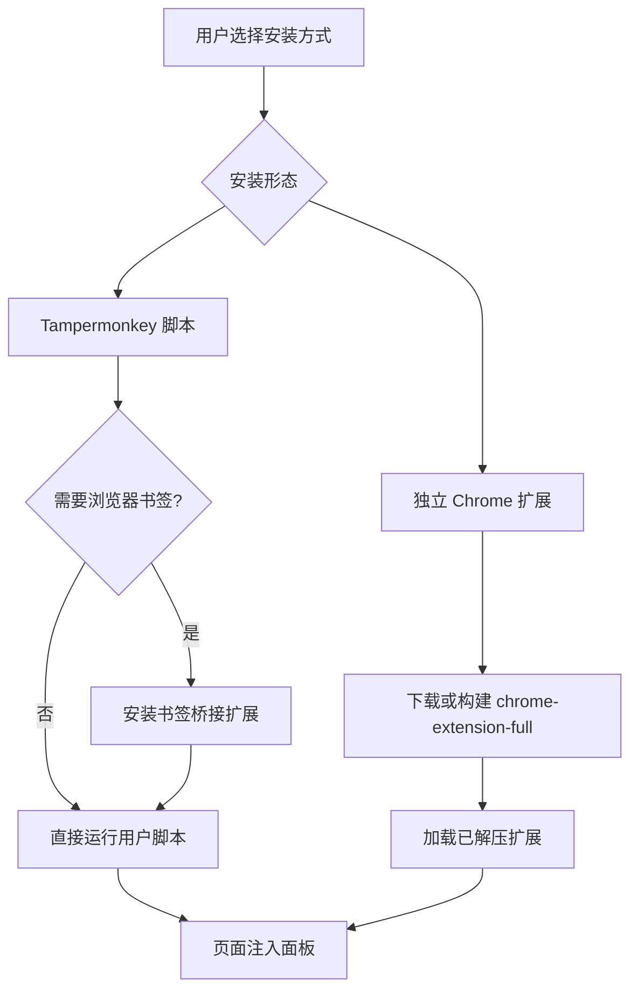
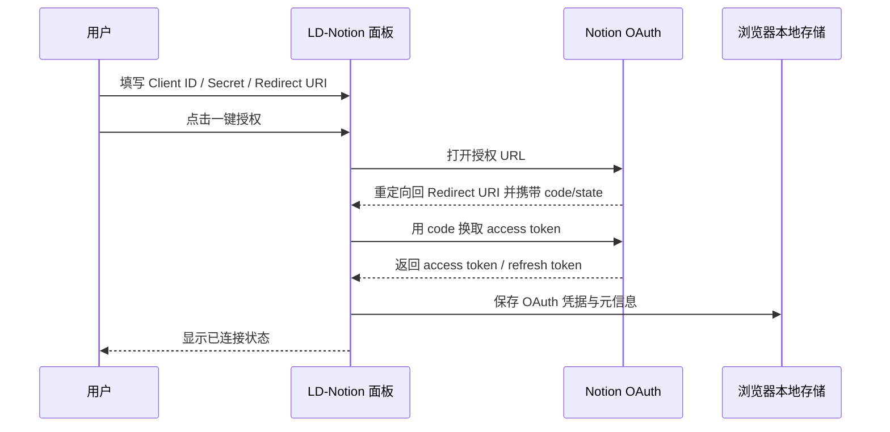
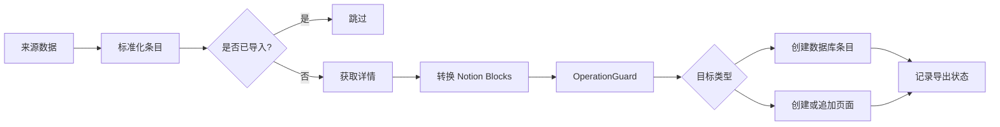
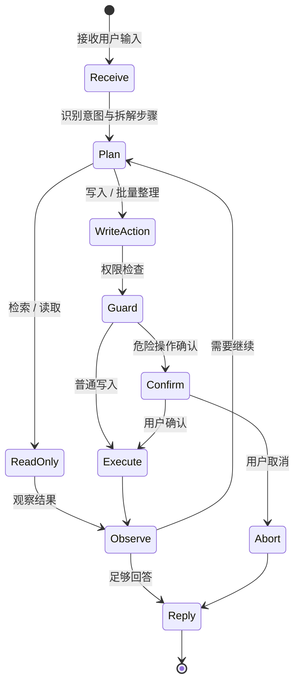
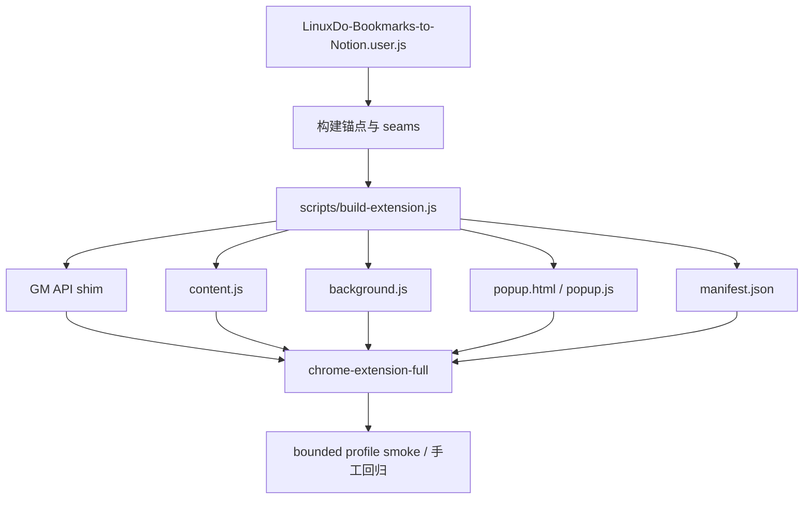

# 关键流程图

本页集中展示 LD-Notion 的核心流程，便于理解安装、授权、导入、AI 执行和扩展构建之间的关系。

## 安装与运行形态

```mermaid
flowchart TD
  Start[用户选择安装方式] --> Choice{安装形态}
  Choice --> TM[Tampermonkey 脚本]
  Choice --> CE[独立 Chrome 扩展]
  TM --> NeedBookmarks{需要浏览器书签?}
  NeedBookmarks -->|是| Bridge[安装书签桥接扩展]
  NeedBookmarks -->|否| RunScript[直接运行用户脚本]
  Bridge --> RunScript
  CE --> Build[下载或构建 chrome-extension-full]
  Build --> Load[加载已解压扩展]
  RunScript --> Panels[页面注入面板]
  Load --> Panels
```

## Notion OAuth 授权

```mermaid
sequenceDiagram
  participant User as 用户
  participant Panel as LD-Notion 面板
  participant Notion as Notion OAuth
  participant Store as 浏览器本地存储

  User->>Panel: 填写 Client ID / Secret / Redirect URI
  User->>Panel: 点击一键授权
  Panel->>Notion: 打开授权 URL
  Notion-->>Panel: 重定向回 Redirect URI 并携带 code/state
  Panel->>Notion: 用 code 换取 access token
  Notion-->>Panel: 返回 access token / refresh token
  Panel->>Store: 保存 OAuth 凭据与元信息
  Panel-->>User: 显示已连接状态
```

## 收藏导入到 Notion

```mermaid
flowchart LR
  Source[来源数据] --> Normalize[标准化条目]
  Normalize --> Dedup{是否已导入?}
  Dedup -->|是| Skip[跳过]
  Dedup -->|否| Detail[获取详情]
  Detail --> Blocks[转换 Notion Blocks]
  Blocks --> Guard[OperationGuard]
  Guard --> Write{目标类型}
  Write --> Database[创建数据库条目]
  Write --> Page[创建或追加页面]
  Database --> Record[记录导出状态]
  Page --> Record
```

## AI 工具调用闭环

```mermaid
stateDiagram-v2
  [*] --> Receive: 接收用户输入
  Receive --> Plan: 识别意图与拆解步骤
  Plan --> ReadOnly: 检索 / 读取
  Plan --> WriteAction: 写入 / 批量整理
  ReadOnly --> Observe: 观察结果
  WriteAction --> Guard: 权限检查
  Guard --> Confirm: 危险操作确认
  Guard --> Execute: 普通写入
  Confirm --> Execute: 用户确认
  Confirm --> Abort: 用户取消
  Execute --> Observe
  Observe --> Plan: 需要继续
  Observe --> Reply: 足够回答
  Abort --> Reply
  Reply --> [*]
```

## 扩展构建链路

```mermaid
flowchart TD
  Script[LinuxDo-Bookmarks-to-Notion.user.js] --> Anchors[构建锚点与 seams]
  Anchors --> Builder[scripts/build-extension.js]
  Builder --> GMShim[GM API shim]
  Builder --> Content[content.js]
  Builder --> Background[background.js]
  Builder --> Popup[popup.html / popup.js]
  Builder --> Manifest[manifest.json]
  GMShim --> Output[chrome-extension-full]
  Content --> Output
  Background --> Output
  Popup --> Output
  Manifest --> Output
  Output --> Smoke[bounded profile smoke / 手工回归]
```
