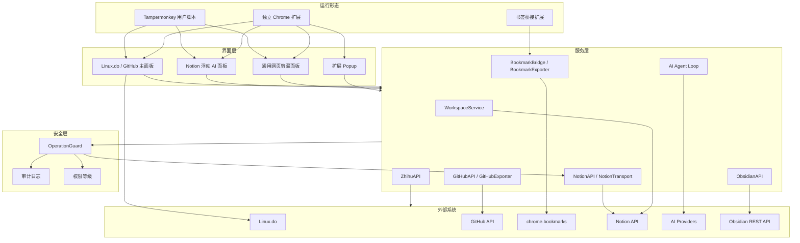

# 整体架构

LD-Notion 是一个浏览器侧应用：核心逻辑运行在用户脚本或扩展 content script 中，通过浏览器存储保存非敏感配置，并通过本地加密凭证保险箱保存敏感凭证，再调用外部 API 读写 Notion、GitHub、AI 服务和 Obsidian。

## 模块结构

## 关键数据流

1. UI 层读取用户配置与来源选择。
2. 来源服务拉取帖子、仓库、书签或网页信息。
3. 解析层清洗内容、保留格式、生成 Notion Blocks 或 Markdown。
4. 可选 AI 层生成摘要、分类、标签或执行对话式任务。
5. 写入前进入 OperationGuard。
6. Notion 或 Obsidian 适配层完成输出。
7. 非敏感状态、日志和导出记录写回浏览器本地存储；敏感凭证写入本地加密保险箱。

## 代码定位

| 模块 | 位置 |
| --- | --- |
| 用户脚本主体 | `LinuxDo-Bookmarks-to-Notion.user.js` |
| 书签桥接扩展 | `chrome-extension/` |
| 独立扩展构建 | `scripts/build-extension.js` 输出 `chrome-extension-full/` |
| 自动化测试 | `tests/` |
| UI 手工回归 | `docs/ui-regression-checklist.md` |

## 设计取舍

- 纯前端部署：安装简单，但共享生产级 secret 仍不适合放进前端；当前通过本地加密保险箱降低个人自用场景下的明文凭证暴露面。
- 单脚本核心：便于 Tampermonkey 分发，但需要构建 seam 来稳定生成扩展版。
- 权限守卫集中化：减少 AI 与用户触发写入入口的安全漂移。
- 多来源统一抽象：跨源搜索和推荐更自然，但来源去重策略需要分别处理。
