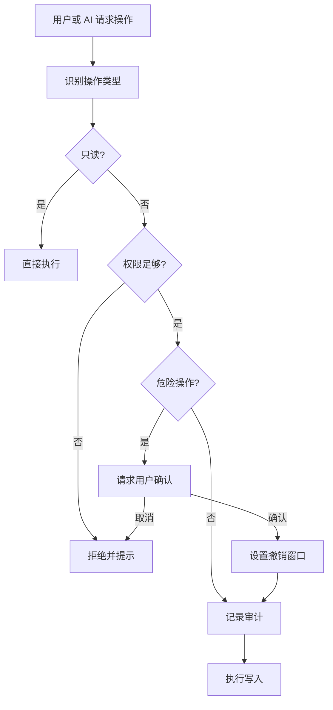

# 安全与权限

LD-Notion 同时支持用户手动操作和 AI 触发操作。为了避免自然语言误操作直接写入工作区，写入口会经过统一守卫层。

## 权限等级

| 等级 | 能力边界 | 适合场景 |
| --- | --- | --- |
| 只读 | 搜索、读取、查看详情 | 初次体验、只问不改 |
| 标准 | 创建页面、写内容、更新属性、自动分类 | 日常整理 |
| 高级 | 移动、复制、归档、数据库结构类操作 | 深度整理 |
| 管理员 | 高风险管理操作 | 确认后短期开启 |

## OperationGuard

## 审计日志

审计日志用于回答两个问题：

1. AI 或用户刚刚做了什么。
2. 如果结果不符合预期，应该从哪一步排查。

日志可在面板中查看和清除。

## OAuth 与本地加密保险箱

- Internal Integration Token、OAuth access token、refresh token、AI API Key、GitHub Token、Obsidian API Key 与 Public OAuth 的 `Client Secret` 都属于敏感凭证。
- 这些敏感凭证现在默认写入本地加密保险箱，而不是继续以旧明文键长期保存在浏览器存储里。
- 保险箱需要用户本地设置口令并在当前会话解锁；解锁后敏感凭证只在当前会话内可读，重新锁定后需要再次解锁。
- 非敏感配置仍保存在浏览器本地存储中，例如目标数据库 ID、面板位置、来源偏好和 OAuth 的 `Client ID` / `Redirect URI`。
- 「断开授权」只清除本地 access token / refresh token，不会撤销 Notion 后台已经批准的授权，也不会自动删除你保留的 OAuth 基础配置。

## v3.7.0 安全加固

v3.7.0 对用户脚本权限域和 AI 输入链路做了系统性加固：

### Userscript 权限域收窄

- `@match` 从 `*://*/*` 替换为 6 个显式站点模式（linux.do、notion.so、github.com、zhihu.com）。
- `@connect` 从 `*` 替换为 9 个显式域名白名单（api.notion.com、linux.do、s3.amazonaws.com、api.openai.com、api.anthropic.com、generativelanguage.googleapis.com、api.github.com、zhihu.com）。
- 新增 `@include` 正则白名单 + `@exclude` 排除搜索引擎/邮箱/localhost，提供纵深防御。
- 这阻止了用户脚本向任意域名发起网络请求（如攻击者控制的 exfil 端点）。

### AI Prompt Injection 多层防御

- **XML 标签隔离**：AI 分类 prompt 将用户内容包裹在 `<user_content>` XML 标签中，与系统指令分离，降低 prompt injection 风险。
- **ChatUI 输出净化**：`escapeHtml` 使用浏览器原生 `textContent→innerHTML` 转义；`safeMarkdown` 先转义全部 HTML，再选择性恢复安全 Markdown 格式（粗体、换行），防止注入 HTML/JS 在聊天 UI 中渲染。
- **UI 全局 escapeHtml**：所有用户可控文本（数据库名、页面标题、错误消息、书签标题、标签、文件名等）在插入 HTML 前统一经过 `Utils.escapeHtml` 转义，覆盖 50+ 处拼接点。

### OperationGuard setLevel 验证

`setLevel` 方法现在强制校验输入值必须为 0-3 的整数，拒绝 `NaN`、`Infinity`、负数或超范围值，防止无效权限级别绕过权限系统。

### 已知待办

- ~~**Extension SSRF 白名单严格匹配**：当前 background service worker 的 URL 白名单使用简单字符串匹配，可被 `evil.amazonaws.com.attacker.com` 绕过。应改用 URL 构造函数解析 hostname 后精确匹配，并限制协议为 https、端口为默认端口。~~（已在 v3.7.4 修复）
- **Extension CredentialVault 移植**：Chrome Extension 版本中 API key 通过 `chrome.storage.local` 明文存储，CredentialVault AES-256-GCM 加密机制尚未移植到 Extension 侧。

## v3.7.4 安全加固

v3.7.4 在 v3.7.3 基础上进一步收紧 URL 安全与输入处理：

### URL 安全与 SSRF

- **Extension background worker 协议限制**：`isUrlAllowed` 现在解析 URL 后，对非本地地址强制校验 `parsed.protocol === "https:"` 且端口为默认 443，防止通过 `http://allowed-host.evil.com` 或自定义端口绕过白名单。
- **循环依赖消除**：`UrlValidator` 提取到 `src/security/UrlValidator.js` 独立模块，消除 `src/api/index.js` 与 `src/security/index.js` 之间的 circular dependency，降低模块加载阶段的安全工具不可用风险。

### 输入净化

- **`post.cooked` 不再直接 `innerHTML`**：`src/export/index.js` 的帖子文本提取改用 `DOMParser.parseFromString(..., "text/html")` 后读取 `textContent`，避免不可信 HTML 在解析阶段执行脚本。

### 弱随机数

- **`Math.random()` 剩余两处清除**：`src/api/index.js` 的 multipart boundary 和 `src/ui/events.js` 的 Obsidian 图片文件名统一改用 `crypto.getRandomValues` 生成随机 hex 字符串。

## v3.7.3 安全加固

v3.7.3 针对 API key 泄露和弱随机数做了专项修复：

### API Key 泄露防护

- **AI 请求 baseUrl 校验**：`AIService._normalizeBaseUrl` 内置 `UrlValidator.validateAiBaseUrl`，仅允许白名单域名（`api.openai.com`、`api.anthropic.com`、`generativelanguage.googleapis.com`）或 HTTPS 非内网域名，阻止攻击者通过自定义 `baseUrl` 将 `Authorization` 头重定向到恶意服务器（SEC-001）。
- **Obsidian API URL 本地限制**：`ObsidianAPI` 三个方法入口调用 `UrlValidator.validateObsidianUrl`，仅允许 `127.0.0.1`/`localhost`/`::1`，阻止篡改存储值后的 API key 泄露（SEC-002）。
- **私有网段拦截**：`UrlValidator._isPrivateHost` 拦截 `10.x`/`172.16-31.x`/`192.168.x`/`169.254.x` 私有 IP 和 link-local 地址，防止 SSRF。

### 弱随机数消除

- **OAuth state token**：`Utils.randomToken` 移除 `Math.random()` 回退，在 `crypto.getRandomValues` 不可用时抛出错误（SEC-005）。
- **审计日志 event ID**：`OperationLog.createEventId` 从 `Math.random()` 改为 `crypto.getRandomValues`（SEC-015）。
- **API key hash**：`WorkspaceService.buildWorkspaceData` 的 `apiKeyHash` 从直接截取后 8 位改为 djb2 hash，避免部分暴露 API key（SEC-011）。

## v3.7.2 UI 安全加固

v3.7.2 通过 UI Odyssey 全维度审查修复了 UI 层面的安全问题：

### innerHTML 注入防护

- `NotionSiteUI.showStatus` 和 `UI.showStatus` 两处状态显示函数通过 `innerHTML` 渲染消息内容，此前直接插入 `message` 和 `type` 参数，存在 XSS 风险。
- 现在两处均使用 `Utils.escapeHtml(message)` 和 `Utils.escapeHtml(type)` 对动态内容转义后再插入。
- `GenericUI.showStatus` 使用 `textContent` 赋值，天然免疫 XSS，无需修改。
- Obsidian 测试连接状态的 `innerHTML` 中 `result.error` 和 `e.message` 也已加 `escapeHtml`。

### 导出操作防重入

- `exportBtn.onclick` 和 `obsExportBtn.onclick` 入口处检查 `disabled` 状态，操作中设 `disabled = true`，`finally` 中恢复 `disabled = false`，防止并发点击导致重复导出。

### 除零与 DOM 爆炸防护

- `showProgress` 中 `current / total` 除法增加 `total > 0` 前置检查，避免 `total = 0` 时产生 `NaN`。
- 导出报告失败项截断为最多 20 条，错误文本截断为 120 字符，防止大量失败项导致 DOM 爆炸。

### 状态定时器冲突修复

- `showStatus` 连续调用时，旧定时器可能在新消息显示期间触发 `container.innerHTML = ""`，导致新消息被提前清除。
- 现在每次调用前先 `clearTimeout(container._statusTimer)`，确保只有最新的定时器生效。

## 推荐安全实践

- 日常使用保持「标准」权限。
- 危险操作确认保持开启。
- 只在需要移动、归档、数据库结构操作时临时切到「高级」。
- 首次保存 Notion Token、OAuth Client Secret、AI API Key 等敏感凭证前，先初始化并解锁本地保险箱。
- 不要把共享生产级 OAuth Client Secret 放进前端配置。
- 在批量操作前先对少量数据试运行。
