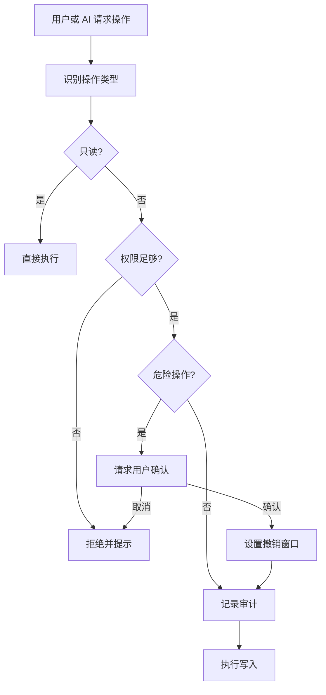

# 安全与权限

LD-Notion 同时支持用户手动操作和 AI 触发操作。为了避免自然语言误操作直接写入工作区，写入口会经过统一守卫层。

## 权限等级

| 等级 | 能力边界 | 适合场景 |
| --- | --- | --- |
| 只读 | 搜索、读取、查看详情 | 初次体验、只问不改 |
| 标准 | 创建页面、写内容、更新属性、自动分类 | 日常整理 |
| 高级 | 移动、复制、归档、数据库结构类操作 | 深度整理 |
| 管理员 | 高风险管理操作 | 确认后短期开启 |

## OperationGuard

## 审计日志

审计日志用于回答两个问题：

1. AI 或用户刚刚做了什么。
2. 如果结果不符合预期，应该从哪一步排查。

日志可在面板中查看和清除。

## OAuth 与本地加密保险箱

- Internal Integration Token、OAuth access token、refresh token、AI API Key、GitHub Token、Obsidian API Key 与 Public OAuth 的 `Client Secret` 都属于敏感凭证。
- 这些敏感凭证现在默认写入本地加密保险箱，而不是继续以旧明文键长期保存在浏览器存储里。
- 保险箱需要用户本地设置口令并在当前会话解锁；解锁后敏感凭证只在当前会话内可读，重新锁定后需要再次解锁。
- 非敏感配置仍保存在浏览器本地存储中，例如目标数据库 ID、面板位置、来源偏好和 OAuth 的 `Client ID` / `Redirect URI`。
- 「断开授权」只清除本地 access token / refresh token，不会撤销 Notion 后台已经批准的授权，也不会自动删除你保留的 OAuth 基础配置。

## 推荐安全实践

- 日常使用保持「标准」权限。
- 危险操作确认保持开启。
- 只在需要移动、归档、数据库结构操作时临时切到「高级」。
- 首次保存 Notion Token、OAuth Client Secret、AI API Key 等敏感凭证前，先初始化并解锁本地保险箱。
- 不要把共享生产级 OAuth Client Secret 放进前端配置。
- 在批量操作前先对少量数据试运行。
