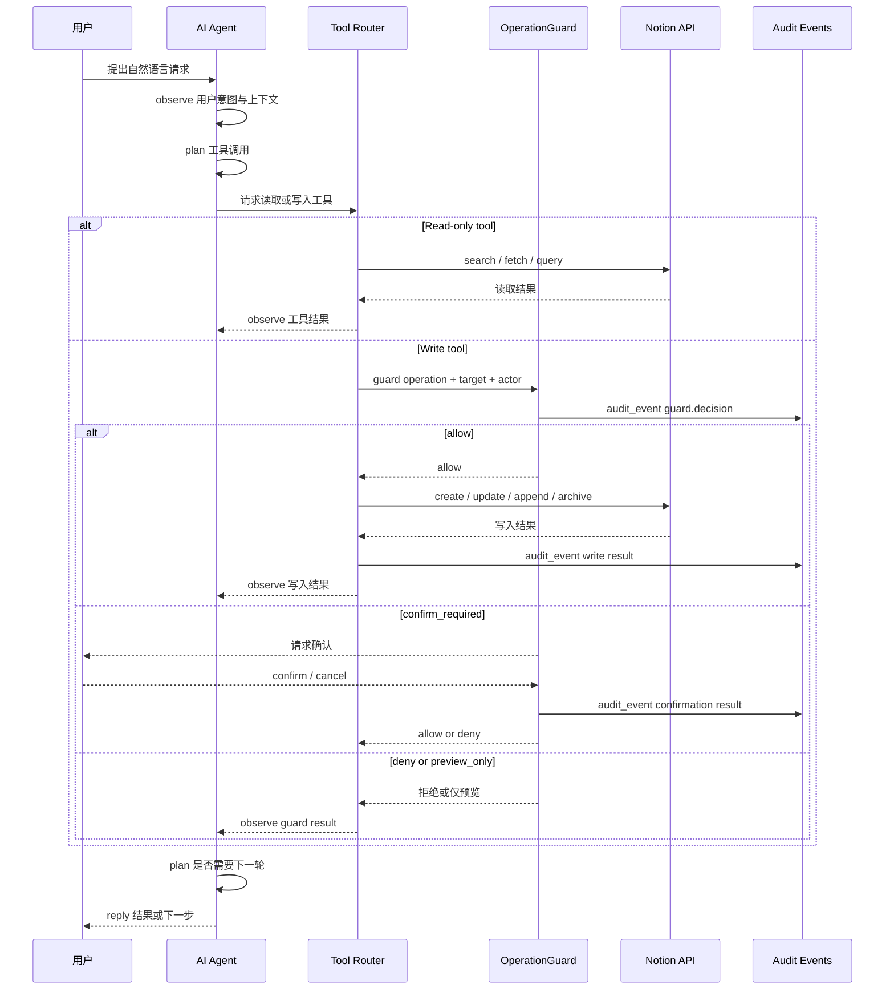

# AI Agent Loop

AI Agent Loop 描述 LD-Notion 的对话式助手如何把自然语言请求转成可观察、可守卫、可审计的工具调用。核心循环是 observe → plan → guard → act → observe → reply。

## Loop overview

| Step | What happens | Output |
| --- | --- | --- |
| observe | 读取用户消息、当前页面上下文、目标配置和上一轮工具结果。 | 任务意图、上下文摘要、缺失信息。 |
| plan | 选择下一步：搜索、读取、写入、批量整理或要求用户补充信息。 | 工具调用计划和风险判断。 |
| guard | 对写入类工具提交 OperationGuard；只读工具可跳过写入检查。 | `allow`、`confirm_required`、`deny` 或 `preview_only`。 |
| act | 执行被允许的工具调用，可能访问 Notion API 或本地导入适配器。 | 工具结果、API 错误或部分成功状态。 |
| observe | 观察工具结果，判断是否需要继续计划下一步。 | 新的事实、失败原因、后续动作。 |
| reply | 向用户说明完成结果、失败原因、需要确认的动作或下一步建议。 | 用户可见回答。 |

## Sequence diagram

## Relationship between AI, tools, Guard, Notion and audit

| Component | Responsibility | Boundary |
| --- | --- | --- |
| AI Agent | 理解请求、拆分步骤、选择工具、组织回复。 | 不能直接写入 Notion。 |
| Tool Router | 把 Agent 计划映射到搜索、读取、写入、导入或批量工具。 | 写入前必须提交 OperationGuard。 |
| OperationGuard | 判断权限等级、危险操作、确认需求和降级路径。 | 是用户与 AI 写入的共同边界。 |
| Notion API | 执行实际读取或写入。 | 受 OAuth/manual token 和 Integration Connections 限制。 |
| Audit Events | 记录 guard decision、写入结果、失败和取消。 | 必须 redaction，不记录真实密钥。 |

## Intent categories

| Intent | Example | Typical permission | Guard behavior |
| --- | --- | --- | --- |
| Search | 搜索 Docker 相关笔记。 | 只读 | 跳过写入检查，可记录读取事件。 |
| Read page | 读取项目计划页面 Markdown。 | 只读 | 跳过写入检查。 |
| Write block | 在页面末尾插入总结。 | 标准 | 检查目标、权限和 auth 后写入。 |
| Update metadata | 加图标、封面、归档或恢复。 | 标准 / 高级 | 高风险动作需要确认。 |
| Batch organize | 给未分类页面打标签。 | 标准 / 高级 | 根据影响范围要求预览或确认。 |
| Import | 导入 GitHub 收藏或浏览器书签。 | 标准 | 先生成 preview，再通过 Guard 写入。 |
| Deep workflow | 总结、翻译、提取为数据库。 | 只读 / 标准 / 高级 | 每个写入步骤单独 guard。 |

## Multi-step behavior

复杂任务可以多轮循环：

1. observe：读取页面或搜索结果。
2. plan：决定需要补充上下文或写入。
3. guard：对写入请求做权限判断。
4. act：调用 Notion API。
5. observe：检查写入返回或失败原因。
6. reply：汇总结果，或进入下一轮。

当 OperationGuard 返回 `deny` 或用户取消确认时，Agent 必须停止对应写入路径，并把失败原因作为 reply 的一部分返回。

## Failure behavior

| Failure | Behavior |
| --- | --- |
| AI provider unavailable | 返回连接或配置错误，不执行写入。 |
| Tool plan lacks target | 请求用户选择数据库、页面或导入目标。 |
| OperationGuard denies write | 停止写入，解释所需权限或授权状态。 |
| User cancels confirmation | 不调用 Notion API，记录取消结果。 |
| Notion API fails | 返回 API 错误摘要，不伪造成功。 |
| Audit write fails | 不重复远端写入；提示本地审计状态异常。 |

## Contract

- AI Agent 必须通过工具层访问 Notion API。
- 写入工具必须经过 OperationGuard。
- audit_event 应区分 `actor: "user"` 与 `actor: "ai"`。
- Agent 回复必须说明成功、失败、取消和被 Guard 阻止的动作。
