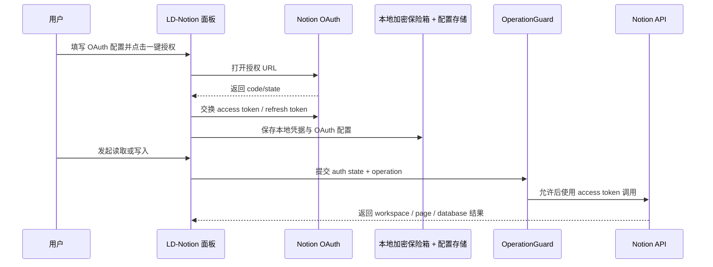

# Auth Model

Auth Model 解释 LD-Notion 如何获得 Notion 访问能力。OAuth 是推荐路径；manual token 是 advanced fallback，主要用于个人 Internal Integration、旧流程兼容和排障。

## 30 秒理解

- OAuth 是推荐路径：用户在 Notion 授权页批准访问，LD-Notion 保存 access token 与 refresh token。
- manual token 是高级兜底：用户手动复制 `secret_` Integration Token 到面板。
- 两种方式都运行在纯前端环境；敏感凭证会持久化到本地加密保险箱，解锁后仅在当前会话中可直接使用。
- 断开授权只清除本地凭据，不会撤销 Notion 后台已经批准的授权。
- Token 可用不等于目标可写；目标数据库或页面还必须连接对应 Integration。

## OAuth / manual token matrix

| Dimension | OAuth | manual token |
| --- | --- | --- |
| Recommended status | 推荐路径，适合日常使用。 | advanced fallback，适合个人集成、调试和 OAuth 不可用时使用。 |
| Setup | 配置 Client ID、Client Secret、Redirect URI 后点击一键授权。 | 在 Notion 创建 Internal Integration，复制 `secret_` token。 |
| Stored locally | `Client ID`、`Redirect URI`、workspace meta 保存在本地配置；access token、refresh token、`Client Secret` 保存在本地加密保险箱。 | Integration token 保存在本地加密保险箱。 |
| Refresh | access token 可通过 refresh token 续签。 | 不支持自动 refresh；失效后需要重新复制。 |
| User effort | 初次配置稍多，后续较少。 | 每个用户都需要理解 Integration 与 Connections。 |
| Security note | `Client Secret` 会进入本地加密保险箱，但项目仍是纯前端，不适合共享生产级 secret。 | token 本身就是长期密钥；虽然现在也保存在本地加密保险箱中，泄露后仍应在 Notion 后台轮换。 |
| Best fit | 个人自建公开集成、一键授权体验、减少手动 token 粘贴。 | 本地个人使用、OAuth 配置失败、排查 Notion API 访问问题。 |
| Failure fallback | 重新授权，或临时切换到 manual token。 | 检查 token、Capabilities、Connections，或改用 OAuth。 |

::: warning 本地凭据风险
LD-Notion 没有独立后端。OAuth Client Secret、OAuth token、manual token、AI API Key 等敏感凭证现在会优先保存在本地加密保险箱中，而不是继续长期留在旧明文键里；但它们依然属于前端本地持有的密钥材料。该模式适合个人自用，不适合把共享生产级 secret 放进前端配置。
:::

## OAuth flow

## Auth routing

| Priority | Condition | Route | Stop condition | User-visible result |
| --- | --- | --- | --- | --- |
| 1 | OAuth connected and access token valid | 使用 OAuth token。 | 目标未连接 Integration。 | 显示工作区、数据库或页面列表。 |
| 2 | OAuth access token expired and refresh token exists | 尝试刷新后重试。 | refresh 失败或 state 不一致。 | 提示重新授权。 |
| 3 | manual token exists | 使用 manual token。 | token 格式错误、401、403 或目标不可达。 | 提示检查 token 和 Connections。 |
| 4 | no credential | 阻止远端写入。 | 无。 | 打开授权配置入口并保留预览。 |

## Target access contract

Notion 授权只说明 token 有机会访问 workspace，不保证目标已经开放给 Integration。写入前仍需检查：

1. Integration 是否具备 `Read content`、`Update content`、`Insert content`。
2. 目标 database 或 page 是否在 Notion 的 `Connections` 中连接该 Integration。
3. 用户选择的是 database 模式还是 page 模式。
4. 手动输入 ID 时是否只输入 32 位 ID，而不是完整 URL。

## Failure modes

| Failure | Likely cause | Fix |
| --- | --- | --- |
| OAuth callback failed | Redirect URI 不一致、state 过期或配置缺失。 | 对齐 Notion 后台与面板中的 Redirect URI。 |
| Workspace list empty | Integration 未连接任何目标。 | 在 Notion 页面或数据库的 `Connections` 中添加 Integration。 |
| `401` | token 过期、错误、撤销或被手动覆盖。 | OAuth 重新授权，或更新 manual token。 |
| `403` | Integration 没有目标权限。 | 检查 Capabilities 与目标 Connections。 |
| Disconnect 后 Notion 后台仍显示授权 | 本地清除不等于后台撤销。 | 到 Notion Integration 后台撤销授权。 |

## Contract

- OAuth 是推荐路径。
- manual token 是 advanced fallback。
- Auth failure 必须在 OperationGuard 或目标 writer 前阻止写入。
- 审计日志和示例不得包含真实 token、Client Secret 或 API Key。
