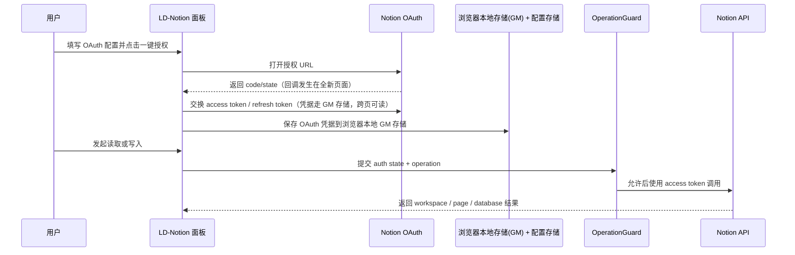

# Auth Model

Auth Model 解释 LD-Notion 如何获得 Notion 访问能力。OAuth 是推荐路径；manual token 是 advanced fallback，主要用于个人 Internal Integration、旧流程兼容和排障。

## 30 秒理解

- OAuth 是推荐路径：用户在 Notion 授权页批准访问，LD-Notion 保存 access token 与 refresh token。
- manual token 是高级兜底：用户手动复制 `secret_` Integration Token 到面板。
- 两种方式都运行在纯前端环境；所有敏感凭证（OAuth 三键、AI/GitHub/Obsidian、Notion token）自 v3.14.2 起统一保存在浏览器本地 GM 存储（明文）——保险箱解锁态为页面内存态，每次页面加载（含脚本更新重载）即锁定，锁定态读空曾导致凭证在更新后看似失效（v3.12.0 先例移出 OAuth 三键，v3.14.2 移出全部剩余敏感键）。
- 断开授权只清除本地凭据，不会撤销 Notion 后台已经批准的授权。
- Token 可用不等于目标可写；目标数据库或页面还必须连接对应 Integration。

## OAuth / manual token matrix

| Dimension | OAuth | manual token |
| --- | --- | --- |
| Recommended status | 推荐路径，适合日常使用。 | advanced fallback，适合个人集成、调试和 OAuth 不可用时使用。 |
| Setup | 配置 Client ID、Client Secret、Redirect URI 后点击一键授权。 | 在 Notion 创建 Internal Integration，复制 `secret_` token。 |
| Stored locally | `Client ID`、`Redirect URI`、workspace meta 保存在本地配置；所有敏感凭证自 v3.14.2 起统一保存在浏览器本地 GM 存储（明文）以保证跨页/更新后可读，审计日志由 `REDACT_IN_LOGS` 统一脱敏。 | Integration token 同样保存在浏览器本地 GM 存储。 |
| Refresh | access token 可通过 refresh token 续签。 | 不支持自动 refresh；失效后需要重新复制。 |
| User effort | 初次配置稍多，后续较少。 | 每个用户都需要理解 Integration 与 Connections。 |
| Security note | `Client Secret` 保存在浏览器本地 GM 存储（跨页可读必需），但项目仍是纯前端，不适合共享生产级 secret。 | token 本身就是长期密钥；泄露后仍应在 Notion 后台轮换。 |
| Best fit | 个人自建公开集成、一键授权体验、减少手动 token 粘贴。 | 本地个人使用、OAuth 配置失败、排查 Notion API 访问问题。 |
| Failure fallback | 重新授权，或临时切换到 manual token。 | 检查 token、Capabilities、Connections，或改用 OAuth。 |

::: warning 本地凭据风险
LD-Notion 没有独立后端。所有敏感凭证（OAuth 三键、AI API Key、GitHub Token、Obsidian Key、Notion manual token）自 v3.14.2 起统一保存在浏览器本地 GM 存储（明文）——这是为了让页面加载（含脚本更新重载）后凭证立即可用，不再要求每次解锁保险箱。历史版本曾用 AES-256-GCM 加密保险箱（v3.12.0 起 OAuth 三键、v3.14.2 起全部敏感键先后移出），但保险箱解锁态为页面内存态、每次加载即锁定，锁定态读空导致“更新后凭证失效”。所有敏感键在审计日志中一律由 `REDACT_IN_LOGS` 超集脱敏。该模式适合个人自用，不适合把共享生产级 secret 放进前端配置。
:::

## OAuth flow

```mermaid
sequenceDiagram
  participant User as 用户
  participant Panel as LD-Notion 面板
  participant NotionOAuth as Notion OAuth
  participant Store as 浏览器本地存储(GM) + 配置存储
  participant Guard as OperationGuard
  participant API as Notion API

  User->>Panel: 填写 OAuth 配置并点击一键授权
  Panel->>NotionOAuth: 打开授权 URL
  NotionOAuth-->>Panel: 返回 code/state（回调发生在全新页面）
  Panel->>NotionOAuth: 交换 access token / refresh token（凭据走 GM 存储，跨页可读）
  Panel->>Store: 保存 OAuth 凭据到浏览器本地 GM 存储
  User->>Panel: 发起读取或写入
  Panel->>Guard: 提交 auth state + operation
  Guard->>API: 允许后使用 access token 调用
  API-->>Panel: 返回 workspace / page / database 结果
```

## Auth routing

| Priority | Condition | Route | Stop condition | User-visible result |
| --- | --- | --- | --- | --- |
| 1 | OAuth connected and access token valid | 使用 OAuth token。 | 目标未连接 Integration。 | 显示工作区、数据库或页面列表。 |
| 2 | OAuth access token expired and refresh token exists | 尝试刷新后重试。 | refresh 失败或 state 不一致。 | 提示重新授权。 |
| 3 | manual token exists | 使用 manual token。 | token 格式错误、401、403 或目标不可达。 | 提示检查 token 和 Connections。 |
| 4 | no credential | 阻止远端写入。 | 无。 | 打开授权配置入口并保留预览。 |

## Target access contract

Notion 授权只说明 token 有机会访问 workspace，不保证目标已经开放给 Integration。写入前仍需检查：

1. Integration 是否具备 `Read content`、`Update content`、`Insert content`。
2. 目标 database 或 page 是否在 Notion 的 `Connections` 中连接该 Integration。
3. 用户选择的是 database 模式还是 page 模式。
4. 手动输入 ID 时是否只输入 32 位 ID，而不是完整 URL。

## Failure modes

| Failure | Likely cause | Fix |
| --- | --- | --- |
| OAuth callback failed | Redirect URI 不一致、state 过期或配置缺失。 | 对齐 Notion 后台与面板中的 Redirect URI。 |
| Workspace list empty | Integration 未连接任何目标。 | 在 Notion 页面或数据库的 `Connections` 中添加 Integration。 |
| `401` | token 过期、错误、撤销或被手动覆盖。 | OAuth 重新授权，或更新 manual token。 |
| `403` | Integration 没有目标权限。 | 检查 Capabilities 与目标 Connections。 |
| Disconnect 后 Notion 后台仍显示授权 | 本地清除不等于后台撤销。 | 到 Notion Integration 后台撤销授权。 |

## v3.14.7 认证语义变更

- **终态判定只信显式标记**：`isAuthTerminalError` 不再做消息子串匹配（子串会把瞬态续签失败误判为终态 fail-fast），只信任 `error.isAuthTerminal === true` 标记。
- **导出循环逐项重解析 token**：每次导出项开工前调用 `getAccessToken("")` 重解析最新 token，避免固定 `settings.apiKey` 快照遮蔽 OAuth 续签后的新 token。
- **空输入不再清 token**：站设置保存时仅显式编辑才清 token，`setManualApiKey` 空值不翻 manual 模式（保护 OAuth 续签状态）。
- **终态降级清残留**：降级时同步清除残留的 `NOTION_API_KEY`，防止下次导出首项即报 token invalid。

## v3.14.10–11 认证语义变更

- **回调快照（#16）**：Notion SPA 常在 `document-idle` 前清掉 `?code&state`，userscript 包体大解析晚时 `handleRedirectCallback` 读不到授权码。修复：`document-start` 启动即 `captureCallbackSnapshot`，回调优先消费快照；跨页监听授权完成态；`matchesRedirectUri` 尾斜杠对齐诊断函数。
- **request token 快照（#20）**：`NotionAPI`/`upload` 在 OAuth 可自动续签时忽略过期的 `apiKey` 快照（不再因旧快照误判 401 终态）。

## v3.14.12–13 认证语义变更

- **空 token 预检（v3.14.12）**：`NotionAPI.request` 发请求前检查 token 为空则立即抛 `EMPTY_TOKEN`(非终态)，不发注定失败的请求；401 终态判定仅限官方认证 code(`unauthorized`/`invalid_bearer_token`)，代理/网关返回的 401 不再无条件判终态。
- **key 清洗统一入口（v3.14.12）**：`getAccessToken`/`setManualApiKey` 剥不可见字符+换行制表符，`validateManualApiKey` 格式软校验(`secret_`/`ntn_` 前缀，不匹配仅警告不阻断)。
- **更新路径 401 风暴消除（v3.14.13）**：Bookmark/RSS 自动导入器每项开工前经 `getAccessToken("")` 重读 token（对齐导出路径 v3.14.7 模式），`isAuthTerminal` 终态抛原错误 fail-fast 中止整批（含归档阶段），`autoImportAborted` 透传 authCode 供 UI 按场景分支文案。
- **setup 首触点透传（v3.14.13）**：`setupDatabaseProperties` 的 `GET /databases` 错误透传 `isAuthTerminal`/`authCode`——token 失效最常见的首个触点此前被包装成普通 Error，场景文案分支不可达。
- **clearConnection 无条件清残留（v3.14.13）**：断开授权/清除按钮无条件清 `NOTION_API_KEY`（此前仅 oauth 模式清，manual 模式下 OAuth 残留 access_token 覆盖的键永不清除 → 定时更新仍直发残留 token 401）；按钮文案明示「清除全部本地凭据(含手动 API Key)」。

## Contract
- manual token 是 advanced fallback。
- Auth failure 必须在 OperationGuard 或目标 writer 前阻止写入。
- 审计日志和示例不得包含真实 token、Client Secret 或 API Key。
