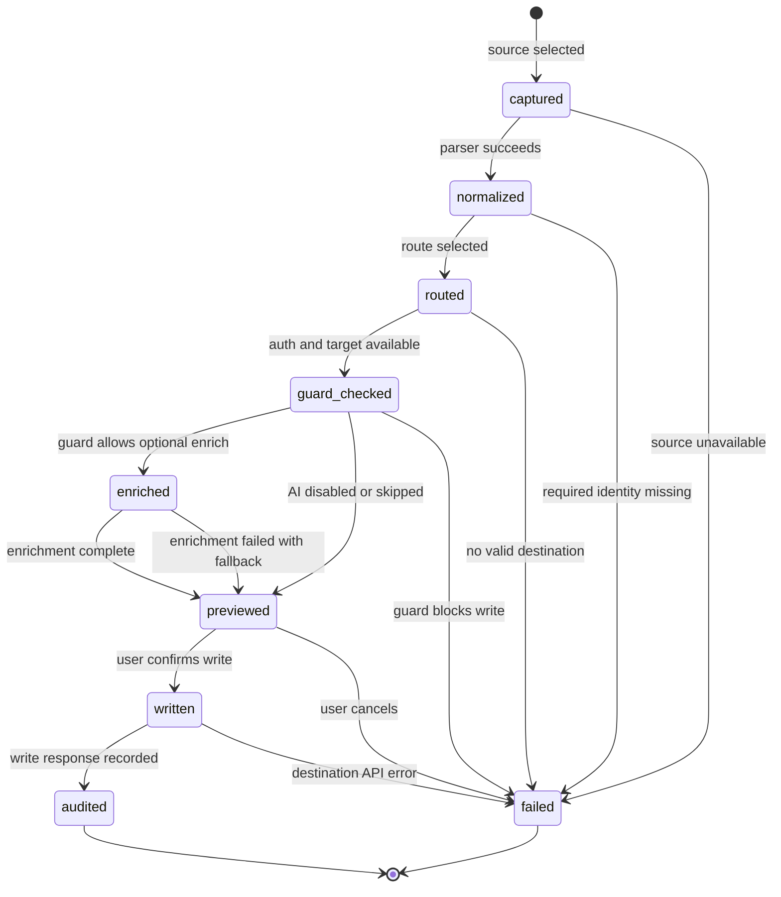

# Import Pipeline

Import Pipeline 描述 LD-Notion 如何把来源数据转换为标准化内容，再输出为 Notion Blocks、Notion database properties 或 Obsidian Markdown。该机制与 Routing Rules、OperationGuard 和来源适配器协作，确保每一步都有可见状态和失败路径。

## Pipeline State Machine

## State Details

| State | Trigger | Guard | Failure path |
| --- | --- | --- | --- |
| captured | 用户选择 Linux.do、GitHub、Bookmarks、Zhihu 或 Generic Web 来源。 | 来源页面、列表项、URL 或扩展能力可读取。 | 来源不可访问时进入 failed，并保留用户可见错误。 |
| normalized | 来源适配器提取 title、body、metadata、sourceId 和 URL。 | identity 至少包含 source、sourceId 或 URL。 | 缺少可识别身份时进入 failed，避免不可追踪写入。 |
| routed | Routing Rules 根据来源、目标、授权、AI 和权限信号选择路径。 | 存在明确 destination 或 preview-only fallback。 | 没有可解释路径时进入 failed。 |
| guard_checked | OperationGuard 检查写入权限、危险级别、目标可用性和确认需求。 | 当前权限等级允许该操作，或操作停在预览。 | 权限不足、授权缺失或用户取消确认时进入 failed。 |
| enriched | AI 或来源详情补全摘要、标签、分类、README、正文或上下文。 | AI 配置可用，且内容允许发送到外部 provider。 | enrich 失败降级到 previewed，不阻断基础导入。 |
| previewed | 用户看到即将写入的 normalized content 和 destination payload。 | 用户可确认、取消或修改目标。 | 用户取消时进入 failed；内容不写入远端。 |
| written | Notion 或 Obsidian 适配器执行创建、追加或保存。 | 目标 API 返回成功响应。 | API 错误、目标失效或网络失败时进入 failed。 |
| audited | 导出记录、guard decision、目标 ID 和失败/成功状态写回本地存储。 | 审计信息可序列化并关联 source identity。 | 审计失败不应重复写入；应提示用户检查本地状态。 |

## Data Flow

1. captured：保存来源项的原始标识和可读字段。
2. normalized：统一 identity、content、metadata、routing 和 audit 字段。
3. routed：选择 Notion database、Notion page、Obsidian 或 preview-only route。
4. guard_checked：应用授权、权限等级、重复检测和危险确认。
5. enriched：可选补充 AI 摘要、标签、分类或来源详情。
6. previewed：展示最终 payload 和 fallback 信息。
7. written：执行目标写入。
8. audited：记录 source identity、destination id、guard decision 和 import status。

## State Contracts

### captured

- 输入：来源页面、API 返回项、书签节点或用户选中文本。
- 输出：sourceItem。
- 失败时：不调用目标写入 API。

### normalized

- 输入：sourceItem。
- 输出：normalizedContent。
- 失败时：提示缺少标题、URL 或 source identity。

### routed

- 输入：normalizedContent、用户目标选择、本地配置。
- 输出：route decision。
- 失败时：降级为 preview-only 或停止。

### guard_checked

- 输入：route decision、permission level、auth state、duplicate marker。
- 输出：allow、confirm_required、blocked 或 preview_only。
- 失败时：写入被阻止，审计 guard decision。

### enriched

- 输入：normalizedContent 与可选 AI / 来源详情配置。
- 输出：增强后的 normalizedContent。
- 失败时：保留基础内容并标记 enrich_failed。

### previewed

- 输入：normalizedContent 与 DestinationPayload。
- 输出：用户确认或取消。
- 失败时：不写入，只保留预览状态。

### written

- 输入：DestinationPayload。
- 输出：Notion page id、database item id 或 Obsidian path。
- 失败时：记录目标 API 错误，不重复自动重试危险写入。

### audited

- 输入：写入结果、guard decision、source identity 和 routing decision。
- 输出：本地导出记录与审计信息。
- 失败时：提示用户检查本地存储状态。

## Related Reference

Normalized schema 与 raw→normalized→destination 示例见 [Normalized Content Schema](/reference/normalized-content-schema)。
