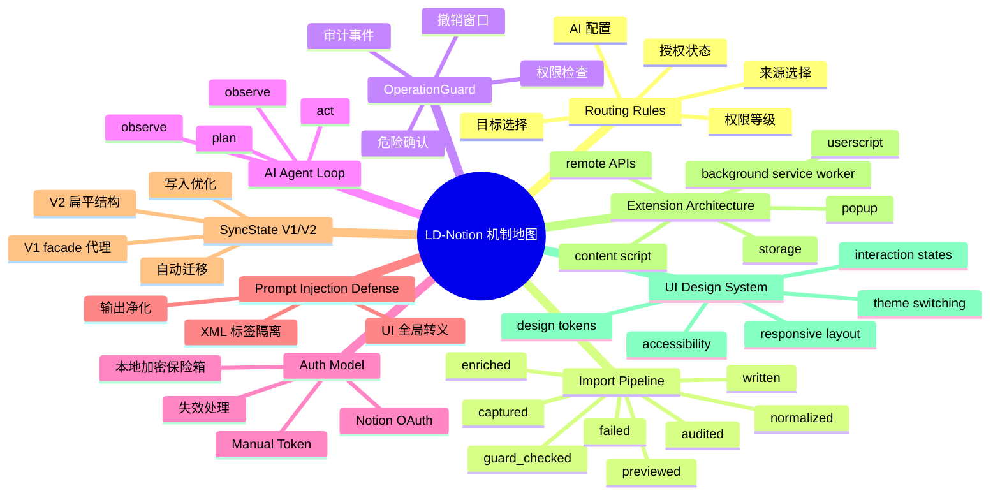

# Concepts

Concepts 分区用于解释 LD-Notion 的架构、路由、权限、AI 与扩展机制。使用功能页解决“怎么做”，使用这里理解“为什么这样流转”。

## 机制地图

## 机制页用途

| 页面 | 用途 |
| --- | --- |
| [Routing Rules](/concepts/routing-rules) | 解释来源、目标、授权、AI 配置和权限等级如何共同决定处理路径。 |
| [Import Pipeline](/concepts/import-pipeline) | 解释内容从捕获、标准化、守卫检查、增强、预览到写入和审计的状态流。 |
| [OperationGuard](/concepts/operation-guard) | 解释写入动作前的权限、确认、审计和撤销边界。 |
| [AI Agent Loop](/concepts/ai-agent-loop) | 解释 AI 助手如何 observe、plan、act，并再次观察结果。 |
| [Auth Model](/concepts/auth-model) | 解释 Notion OAuth、manual token、本地加密保险箱和授权失败处理。 |
| [Prompt Injection Defense](/concepts/prompt-injection-defense) | 解释 AI 输入隔离、输出净化和 UI 全局转义的多层防御体系。 |
| [SyncState V1/V2 迁移](/concepts/syncstate-migration) | 解释 SyncState 从嵌套 V1 到扁平 V2 的迁移、facade 代理和写入优化。 |
| [Extension Architecture](/concepts/extension-architecture) | 解释 userscript、Chrome 扩展、构建 seam、权限和部署边界。 |
| [UI 设计系统](/concepts/design-system) | 解释设计 token、主题切换、交互状态、可访问性和响应式布局规范。 |
