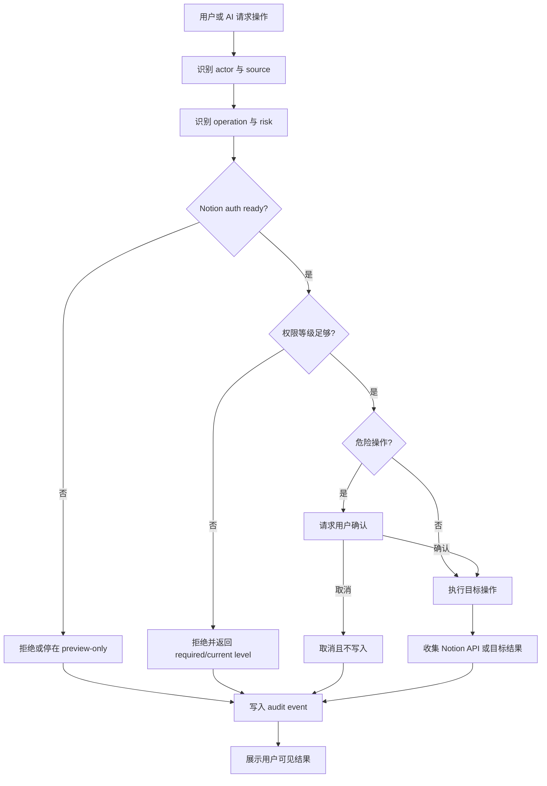

# OperationGuard

OperationGuard 是 LD-Notion 的权限网关 + 审计系统。它把用户点击、批量导入和 AI Agent 工具调用统一收束到同一条安全边界：先判断授权与权限，再决定允许、确认、拒绝或降级，最后记录可追踪的审计事件。

## Mental model

OperationGuard 不替代 Notion 权限，也不绕过 Integration 的连接范围。它负责在浏览器侧回答四个问题：

1. 当前 actor 是用户直接操作，还是 AI 代为执行。
2. 当前 operation 需要什么权限等级。
3. 是否需要用户确认或只允许预览。
4. 结果应该如何进入 audit event。

## 权限等级表

| Level | Name | Capability boundary | Typical operations |
| --- | --- | --- | --- |
| 0 | 只读 | 搜索、读取、查看详情，不写入远端目标。 | `search`、`fetchPage`、`fetchBlocks`、`queryDatabase` |
| 1 | 标准 | 创建页面、追加块、更新属性和普通导入。 | `createDatabasePage`、`updatePage`、`appendBlocks`、`createComment` |
| 2 | 高级 | 移动、复制、归档、恢复、替换正文和 Agent 批量任务。 | `movePage`、`duplicatePage`、`deletePage`、`restorePage`、`agentTask` |
| 3 | 管理员 | 管理类或结构类高风险操作。 | 数据库结构调整、维护类操作 |

默认使用标准权限。只读权限适合初次体验；高级和管理员权限应短期开启，用完后降回标准或只读。

## Guard lifecycle

## Permission decision table

| Operation family | Example operations | Required level | Confirmation | Audit event | Fallback |
| --- | --- | --- | --- | --- | --- |
| Workspace read | `search`、`fetchPage`、`fetchDatabase` | 只读 | No | `read.workspace.searched` / optional read event | 显示读取失败原因。 |
| Page create / append | `createDatabasePage`、`appendBlocks` | 标准 | No | `write.page.created`、`write.block.inserted` | 停在预览，不调用 Notion API。 |
| Property update | `updatePage`、`updateDatabase` | 标准 | No | `write.property.updated` | 提示提升到标准权限。 |
| AI agent task | `agentTask` | 高级 | When write is planned | `agent.tool.requested`、`guard.decision` | 降级为只读建议或操作草案。 |
| Move / duplicate | `movePage`、`duplicatePage` | 高级 | Yes for broad changes | `page.moved`、`page.duplicated` | 要求确认或拆分为小批次。 |
| Archive / restore | `deletePage`、`restorePage` | 高级 | Yes | `page.archived`、`page.restored` | 用户取消时不写入。 |
| Permanent block delete | `deleteBlock` | 高级 | Yes, stricter prompt | `block.deleted` | 取消或拒绝；不承诺可撤销。 |
| Unknown operation | 未登记工具或动作 | N/A | N/A | `guard.denied` | 默认拒绝。 |

## Decision outputs

| Decision | Meaning | User-visible result |
| --- | --- | --- |
| `allow` | 权限、授权和目标都满足要求。 | 执行操作并展示成功或失败结果。 |
| `confirm_required` | 权限足够，但操作风险高或影响范围大。 | 展示确认框；确认前不写入。 |
| `deny` | 权限不足、授权缺失、目标不可达或操作未知。 | 显示拒绝原因和下一步配置建议。 |
| `preview_only` | 内容可生成，但不能安全写入。 | 展示即将写入的 payload，等待用户修正配置。 |

## Failure / override policy

| Situation | Policy |
| --- | --- |
| 权限不足 | 写入前停止，返回所需权限等级和当前等级。 |
| Notion auth missing or expired | 不调用写入 API，提示 OAuth 重新授权或 manual token 配置。 |
| 用户取消危险确认 | 不写入；如果启用审计，记录取消事件。 |
| Notion API failure | 返回原始失败状态的可读摘要，不伪造成功，不自动重复危险写入。 |
| AI 建议高风险动作 | AI 只能提出计划，OperationGuard 决定是否可执行。 |
| 审计日志关闭 | 权限规则仍然生效；UI 应让用户知道审计关闭。 |
| 用户要求 override | 只能通过提升权限等级和完成确认实现；不能跳过 Guard。 |
| 可撤销性 | 只对明确支持恢复的动作提供撤销提示；永久删除块不承诺可撤销。 |

## Audit contract

每次受控写入都应生成 audit event，至少包含 actor、source、operation、target、decision、result 和 redaction 信息。Token、OAuth Client Secret、AI API Key、GitHub Token 与 Obsidian API Key 必须被脱敏。

更多事件格式见 [Audit Events](/reference/audit-events)。
