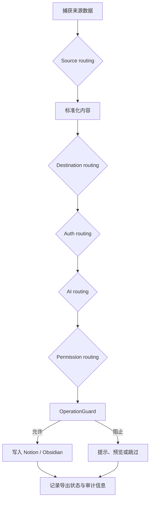

# Routing Rules

Routing Rules 描述 LD-Notion 在当前系统中如何根据来源、目标、授权、AI 配置和权限等级选择处理路径。这里的规则是对现有 UI、服务层、OperationGuard 和导出适配层行为的文档化约定，不代表存在独立的 routing engine。

## Mental Model

一次导入或 AI 写入请求先收集输入信号，再按优先级选择来源处理器、目标适配器、授权方式、AI 增强路径和权限守卫。最终只有通过 Guard 的路径可以写入 Notion 或 Obsidian。

## Inputs and Signals

| Signal | 来源 | 用途 |
| --- | --- | --- |
| source type | Linux.do、GitHub、Bookmarks、Zhihu、Generic Web | 决定解析器和详情获取方式。 |
| destination | Notion database、Notion page、Obsidian | 决定 payload 格式和写入 API。 |
| auth state | OAuth、manual token、missing auth | 决定是否可以访问 Notion 或外部服务。 |
| AI config | provider、model、enabled、fallback | 决定是否生成摘要、标签、分类或对话式任务结果。 |
| permission level | read-only、standard、advanced、admin | 决定是否允许写入、批量整理或危险操作。 |
| duplicate marker | 已导出记录、sourceId、URL | 决定跳过、更新或创建新条目。 |

## Route Priority

1. 安全与授权优先于写入目标：没有有效授权时不进入 Notion 写入。
2. 明确用户选择优先于自动推断：用户指定目标库、页面或 Obsidian 时使用显式选择。
3. 来源专用解析优先于通用网页解析：已识别来源使用专用字段和详情接口。
4. AI 增强是可选步骤：AI 失败不应阻断基础导入。
5. OperationGuard 是最终写入边界：所有写入路径都必须经过权限与审计检查。

## Decision Tables

### Source routing

| Priority | Input signal | Condition | Route | Guard | Fallback |
| --- | --- | --- | --- | --- | --- |
| 1 | 当前页面域名与数据结构 | 匹配 Linux.do 收藏或帖子页面 | 使用 Linux.do 解析与详情获取 | 检查读取来源与导出权限 | 仅保留列表中可读字段并提示详情缺失。 |
| 2 | GitHub URL 或仓库元信息 | 匹配 repository、issue、discussion 或 README | 使用 GitHubAPI / GitHubExporter | 检查 GitHub 请求限制与目标写入权限 | 保存 URL、标题和基础元数据，跳过深度内容。 |
| 3 | chrome.bookmarks 可用性 | 浏览器书签桥接扩展或独立扩展可用 | 使用 BookmarkBridge / BookmarkExporter | 检查扩展权限与用户选择范围 | 提示安装桥接扩展或改用手动网页剪藏。 |
| 4 | Zhihu URL 或页面结构 | 匹配知乎内容页 | 使用 ZhihuAPI 或页面解析 | 检查内容可访问性 | 使用 Generic Web 摘要路径。 |
| 5 | 任意网页 URL | 未匹配专用来源 | 使用 Generic Web 剪藏 | 检查页面可读内容 | 保存标题、URL 和用户选中文本。 |

### Destination routing

| Priority | Input signal | Condition | Route | Guard | Fallback |
| --- | --- | --- | --- | --- | --- |
| 1 | 用户目标选择 | 选择 Notion database | 转换为 Notion database properties + blocks | 需要 Notion 写入权限与 database access | 降级到预览，不自动创建条目。 |
| 2 | 用户目标选择 | 选择 Notion page | 转换为 append children 或创建子页面 | 需要页面写入权限 | 提示重新选择可写页面。 |
| 3 | 用户目标选择 | 选择 Obsidian | 转换为 Markdown 与 frontmatter | 需要 Obsidian REST API 配置 | 保留 Markdown 预览并等待用户复制。 |
| 4 | 已保存默认目标 | 用户未选择但存在默认 database/page | 使用默认目标 | 检查默认目标仍可访问 | 要求用户重新配置目标。 |
| 5 | 无目标信号 | 没有可用目标 | 进入 preview-only route | 禁止写入 | 仅展示标准化结果。 |

### Auth routing

| Priority | Input signal | Condition | Route | Guard | Fallback |
| --- | --- | --- | --- | --- | --- |
| 1 | Notion OAuth token | access token 有效 | 使用 OAuth NotionTransport | 检查 workspace 与目标 access | 若 401，尝试刷新或提示重新授权。 |
| 2 | refresh token | access token 过期且 refresh token 可用 | 刷新凭据后继续 | 检查 state 与本地存储一致性 | 刷新失败时进入 missing auth。 |
| 3 | manual token | 用户配置 integration token | 使用 manual token 写入 | 标记为高级 fallback，需要目标显式授权 | 提示优先使用 OAuth。 |
| 4 | 外部来源 token | GitHub 或 Obsidian token 可用 | 使用对应来源或目标 API | 检查 token 作用域 | 降级为公开页面或本地预览。 |
| 5 | missing auth | 缺少必要凭据 | 阻止远程写入 | OperationGuard 返回 auth_required | 显示配置入口和待写入预览。 |

### AI routing

| Priority | Input signal | Condition | Route | Guard | Fallback |
| --- | --- | --- | --- | --- | --- |
| 1 | AI enabled + provider configured | 用户启用摘要、标签或分类 | 调用 AI provider enrich normalized content | 检查是否包含敏感内容与用户权限 | AI 失败时保留原始内容继续导入。 |
| 2 | AI enabled + agent action | 用户请求对话式整理或批量操作 | 进入 AI Agent Loop，再提交 OperationGuard | 写入动作必须二次确认 | 降级为只读建议。 |
| 3 | AI disabled | 用户关闭 AI | 跳过 enrich | 无额外 AI guard | 使用来源原始标签和人工输入。 |
| 4 | provider missing | 没有 API key 或模型配置 | 跳过 AI route | 不发送外部请求 | 提示配置 AI，但不阻断导入。 |
| 5 | AI timeout / quota | provider 返回错误 | 标记 enrich_failed | 审计失败原因 | 写入基础 normalized content。 |

### Permission routing

| Priority | Input signal | Condition | Route | Guard | Fallback |
| --- | --- | --- | --- | --- | --- |
| 1 | permission level | read-only | 允许读取、搜索、预览 | 阻止所有写入 | 展示 preview-only 结果。 |
| 2 | permission level | standard | 允许单条导入和普通追加 | 阻止批量删除、覆盖和危险整理 | 要求提升权限或拆分为单条操作。 |
| 3 | permission level | advanced | 允许批量导入与模板化写入 | 危险操作需要确认 | 进入确认对话。 |
| 4 | permission level | admin | 允许维护类操作 | 仍记录审计事件 | 若目标不可达仍阻止写入。 |
| 5 | permission unknown | 无权限等级或配置损坏 | 使用 read-only route | 默认拒绝写入 | 提示重置权限配置。 |

## Fallback Behavior

| 场景 | 默认 fallback |
| --- | --- |
| 未识别来源 | 使用 Generic Web 路径，只保存标题、URL、选中文本和基础摘要。 |
| 目标不可写 | 停在预览状态，不创建 Notion 或 Obsidian 内容。 |
| 授权失效 | 提示重新授权，保留本次 normalized content。 |
| AI 失败 | 跳过 AI enrich，继续基础导入并记录失败原因。 |
| 权限不足 | 阻止写入，展示需要的权限等级和用户可执行的替代操作。 |
| 重复内容 | 优先跳过；如果用户显式选择更新，则再次进入 Guard。 |

## Implementation Contract

- Routing Rules 接收来源信号、目标选择、授权状态、AI 配置、权限等级和重复检测结果。
- Routing Rules 输出一个用户可解释的处理路径：source adapter、destination adapter、auth strategy、AI enrich mode、permission decision。
- 所有写入路径必须经过 OperationGuard。
- 所有 fallback 都必须保留用户可见状态，不能静默丢弃内容。
- 文档中的 schema 与状态名用于描述跨模块契约，不要求代码中存在同名类型。

## Troubleshooting

| 现象 | 可能原因 | 处理方式 |
| --- | --- | --- |
| 页面只能预览不能写入 | missing auth、read-only permission 或目标不可写 | 检查 Notion 授权、目标页面权限和权限等级。 |
| GitHub 内容只有标题和 URL | API 限制、仓库不可访问或详情获取失败 | 检查 GitHub 访问状态，或接受基础导入结果。 |
| AI 摘要没有生成 | AI disabled、provider missing、quota 或 timeout | 检查 AI 配置；导入仍会使用基础内容。 |
| 书签导入不可用 | Tampermonkey 无 chrome.bookmarks 权限 | 安装书签桥接扩展或使用独立 Chrome 扩展。 |
| 同一内容被跳过 | sourceId 或 URL 命中已导出记录 | 在确认重复后选择更新或更换目标集合。 |
