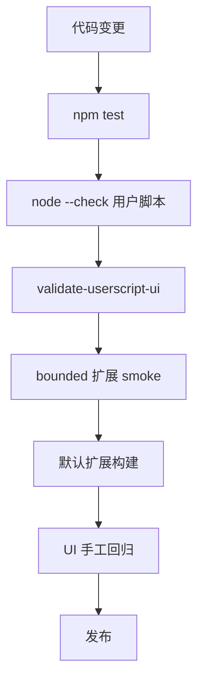

# 开发与验证

LD-Notion 的交付目标包括用户脚本和独立扩展，因此验证要同时覆盖脚本语法、核心单测、UI 静态检查、扩展构建和手工回归。

## 常用命令

```bash
npm test
```

运行核心 Node 测试。

```bash
npm run verify:baseline
```

执行测试、用户脚本语法检查和 UI 静态校验。

```bash
npm run verify:extension:bounded
```

使用收敛权限 profile 做扩展构建 smoke。

```bash
npm run build:extension
```

生成默认发布形态的 `chrome-extension-full/`。

```bash
npm run verify:delivery
```

串行执行 baseline、bounded smoke 和默认扩展构建。

## 文档站命令

```bash
npm run docs:dev
```

本地启动文档站开发服务。

```bash
npm run docs:build
```

构建静态文档站。

```bash
npm run docs:preview
```

预览构建产物。

## 验证梯度



## 手工回归

UI 大改后参考 `docs/ui-regression-checklist.md`，覆盖：

- Linux.do 收藏页 UI 面板。
- Notion 浮动 AI 面板。
- 通用网页剪藏导出面板。
- `chrome-extension-full` 独立扩展形态。

## 构建 seam

独立扩展不是手写维护一份完整副本，而是从用户脚本主体和构建 seam 生成。这样能减少双份逻辑漂移，但要求：

- 用户脚本中的构建锚点保持稳定。
- `BookmarkBridge`、GM shim、content script、popup、background、manifest 的生成契约保持可验证。
- 源码形状发生变化时，优先让构建脚本 fail fast，而不是生成不完整扩展。
