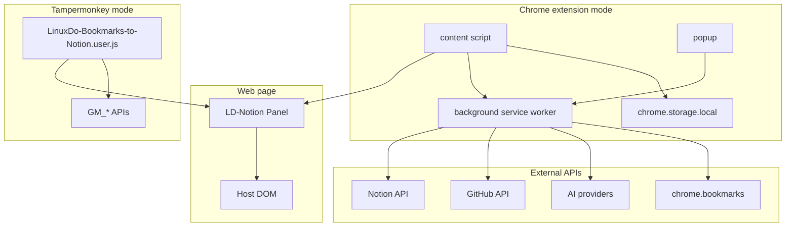
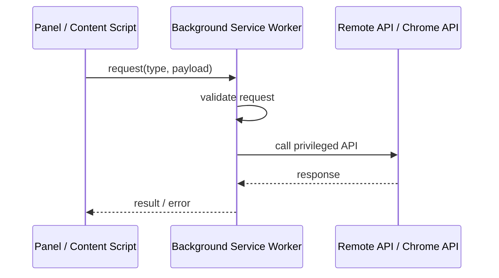

# Chrome Extension Architecture

LD-Notion 有两种运行形态：Tampermonkey 用户脚本和独立 Chrome 扩展。两者共享核心能力，但浏览器权限、存储和跨域请求边界不同。

## Boundary diagram

## Runtime roles

| Component | Responsibility |
| --- | --- |
| userscript | 直接注入页面，使用 GM API 进行存储和跨域请求 |
| content script | 独立扩展的页面注入入口 |
| background service worker | 跨域代理、扩展特权 API、消息中转 |
| popup | 扩展工具栏入口和快速操作面 |
| chrome.storage.local | 独立扩展形态下的本地配置存储 |
| chrome.bookmarks | 书签导入能力 |

## Message boundary

扩展形态下，页面内容脚本不应直接拥有所有能力。需要特权 API 时，通过 message bridge 请求 background service worker：

## Contract

- Content script SHOULD validate incoming page context before triggering privileged actions。
- Background service worker SHOULD be treated as the privileged control plane。
- Extension messages SHOULD have explicit `type` and payload shape。
- Secrets MUST stay in extension or userscript storage, not in page DOM。
