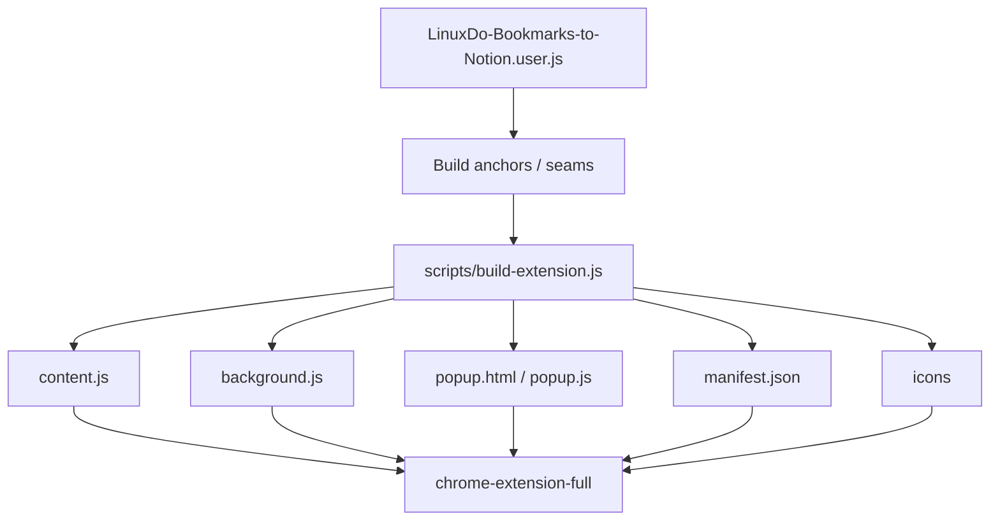

# Build Seams

Build seams 是 userscript 与独立扩展之间的构建边界。LD-Notion 的核心逻辑主要维护在 `LinuxDo-Bookmarks-to-Notion.user.js`，扩展版通过构建脚本生成 `chrome-extension-full/`。

## Build pipeline



## Why seams exist

如果脚本版和扩展版完全手写两份逻辑，会出现双份维护和行为漂移。构建 seam 的目标是：

- 让核心逻辑保持单一来源。
- 让扩展所需的 GM shim、background、popup、manifest 可自动生成。
- 当源码形状变化破坏构建契约时 fail fast。

## Seam examples

| Seam | Purpose |
| --- | --- |
| user script body anchor | 确定可抽取的主体范围 |
| BookmarkBridge patch | 在扩展版中替换为 `chrome.bookmarks` 直连能力 |
| GM API shim | 将 GM 存储 / 请求映射到扩展能力 |
| content script marker | 标记注入区和 UI 初始化区 |
| manifest profile | 支持默认 release profile 和 bounded smoke profile |

## Verification commands

```bash
npm --prefix LD-Notion run verify:baseline
```

```bash
npm --prefix LD-Notion run verify:extension:bounded
```

```bash
npm --prefix LD-Notion run build:extension
```

## Contract

- Build seams MUST stay explicit and testable。
- Extension build SHOULD fail before producing incomplete extension。
- `chrome-extension-full/` is generated output and SHOULD NOT be edited manually。
- Source changes that affect anchors SHOULD update build verification at the same time。
