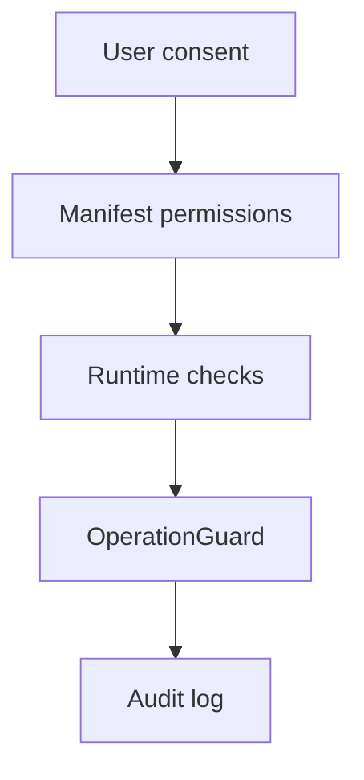

# Extension Permissions

扩展权限应被理解为能力声明，而不是权限清单。每个权限都应该能映射到用户可见功能。

## feature-to-permission table

| Feature | Permission / host access | Why it is needed |
| --- | --- | --- |
| 浏览器书签导入 | `bookmarks` | 读取用户书签树和文件夹路径 |
| Notion 写入 | `api.notion.com` host access | 创建页面、更新属性、读取工作区列表 |
| GitHub 导入 | `api.github.com` host access | 读取 Stars、Repos、Forks、Gists |
| AI 助手 | AI provider host access | 调用 OpenAI、Anthropic、Gemini 或自定义端点 |
| 通用网页剪藏 | host page access | 读取当前页面标题、摘要和 DOM 线索 |
| 本地配置与保险箱 | extension storage / GM storage | 保存非敏感配置，以及敏感凭证的加密保险箱 payload |

## Required vs optional

当前仓库有两条扩展交付链，权限边界需要分开理解：

- `chrome-extension/manifest.json` 是书签桥接扩展，只声明 `bookmarks` 权限，并在所有 `http/https` 页面注入 content script。
- 书签桥接扩展虽然注入范围较宽，但运行时只有在页面上存在活动中的 LD-Notion 根节点时，才会响应书签桥接请求。
- `scripts/build-extension.js` 生成的 `chrome-extension-full/` 默认使用 `bounded_hosts` profile：跨域网络 `host_permissions` 只覆盖 Linux.do、Notion API、GitHub API、AI provider 与必要的 AWS 资源。
- 为了保持与 userscript 一致的 GitHub / Zhihu / 通用网页入口，`chrome-extension-full/` 的 `content_scripts.matches` 仍覆盖这些页面，并通过 `exclude_matches` 排除搜索引擎、邮箱与本地开发地址。
- 如果未来进入浏览器商店分发，应继续评估 optional permissions，以进一步降低初始信任成本。

## Trust boundaries

## Contract

- Permissions SHOULD map to documented features。
- Secrets MUST NOT be written into DOM。
- Dangerous Notion writes MUST still pass OperationGuard, even if extension permissions allow network access。
- The bookmark-bridge extension MUST reject bridge requests outside an active LD-Notion panel context。
- `bounded_hosts` SHOULD remain the default release profile for `chrome-extension-full` unless a narrower production profile replaces it。
