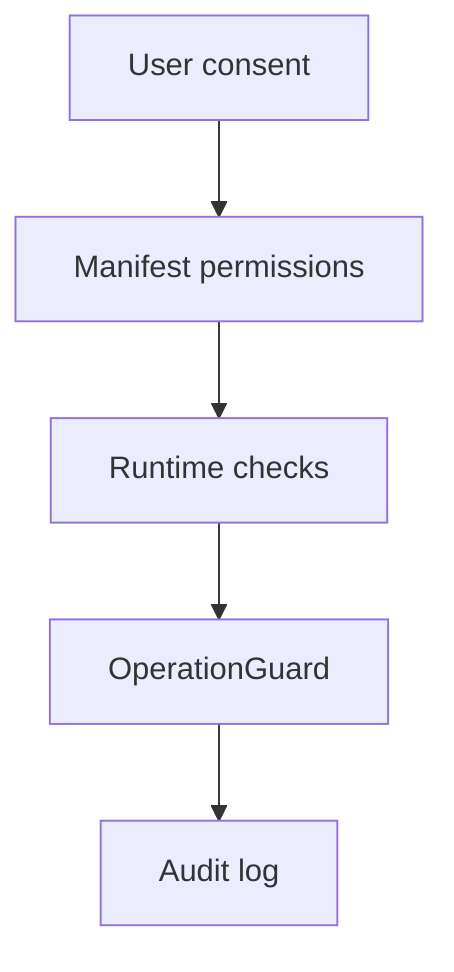

# Extension Permissions

扩展权限应被理解为能力声明，而不是权限清单。每个权限都应该能映射到用户可见功能。

## feature-to-permission table

| Feature | Permission / host access | Why it is needed |
| --- | --- | --- |
| 浏览器书签导入 | `bookmarks` | 读取用户书签树和文件夹路径 |
| Notion 写入 | `api.notion.com` host access | 创建页面、更新属性、读取工作区列表 |
| GitHub 导入 | `api.github.com` host access | 读取 Stars、Repos、Forks、Gists |
| AI 助手 | AI provider host access | 调用 OpenAI、Anthropic、Gemini 或自定义端点 |
| 通用网页剪藏 | host page access | 读取当前页面标题、摘要和 DOM 线索 |
| 本地配置 | extension storage / GM storage | 保存 token、目标库、面板位置和偏好 |

## Required vs optional

当前本地解压扩展更偏发布便利，manifest 可能保留较宽 host permissions。文档上应明确：

- 宽权限用于多来源剪藏和跨域 API 访问。
- 更收敛的 `bounded_hosts` profile 用于开发 smoke 验证。
- 如果未来进入浏览器商店分发，应考虑 optional permissions 降低初始信任成本。

## Trust boundaries

## Contract

- Permissions SHOULD map to documented features。
- Secrets MUST NOT be written into DOM。
- Dangerous Notion writes MUST still pass OperationGuard, even if extension permissions allow network access。
- `bounded_hosts` SHOULD be used as smoke profile, not necessarily as default release profile。
