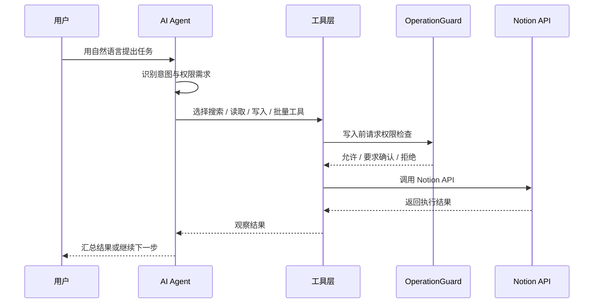

# AI 助手

AI 助手让你用自然语言管理 Notion 工作区。它在 Linux.do 面板和 Notion 站点浮动面板中共享配置，也能参与跨源整理任务。

## 支持的 AI 服务

- OpenAI
- Anthropic
- Google Gemini
- 自定义 Base URL 兼容服务

AI API Key 与 Notion API Key 是两套配置，不要混用。

## 命令类别

| 类别 | 示例 | 权限 |
| --- | --- | --- |
| 工作区检索 | 搜索关于 Docker 的内容 | 只读 |
| 对象详情 | 查看这个 Notion 链接 | 只读 |
| 页面读取 | 读取项目计划页面 Markdown | 只读 |
| 块编辑 | 在页面末尾插入一段说明 | 标准 |
| 页面整理 | 给页面加封面、归档、恢复 | 标准 / 高级 |
| 批量处理 | 自动分类未分类页面、批量打标签 | 标准 |
| 深度工作流 | 总结、翻译、头脑风暴、提取为数据库 | 只读 / 标准 / 高级 |
| 跨源导入 | 导入 GitHub 收藏、导入浏览器书签 | 标准 |

## Agent Loop

AI 助手采用 ReAct 风格循环：识别意图、选择工具、执行、观察结果，再决定下一步。



## 稳定表达建议

当前更稳定的直达短语集中在：

- 页面、数据库对象详情。
- 页面 Markdown、块结构、评论。
- Notion 链接对象读取。
- 页面或块文本写入。
- 页面图标、封面、锁定、归档、恢复。

复杂任务可以直接说目标，AI 会拆步骤，但涉及写入时仍会经过权限守卫。

## 使用示例

```text
搜索关于 Kubernetes 的笔记
```

```text
读取“项目计划”页面 Markdown，然后总结行动项
```

```text
把未分类的 GitHub 收藏按技术方向打标签
```

```text
在“学习笔记”页面末尾插入一段关于 Docker 网络的总结
```
