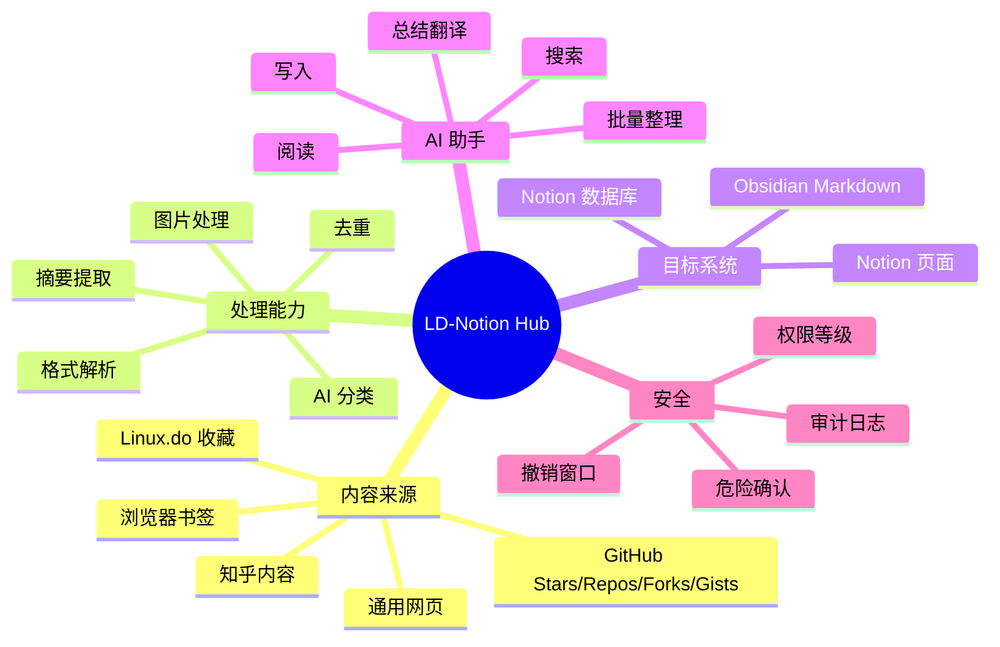

# 功能地图

LD-Notion 的核心不是单一导出工具，而是一套浏览器侧知识采集与工作区管理层。

## 能力总览

## 入口与典型任务

| 入口 | 典型任务 | 输出 |
| --- | --- | --- |
| Linux.do 面板 | 导出收藏、筛选楼层、保留格式、自动导入 | Notion 数据库 / 页面 |
| GitHub 来源分区 | 导入 Stars、Repos、Forks、Gists，并按 README 语义分类 | Notion 数据库 |
| 浏览器书签 | 读取书签树、保留路径、抽取网页摘要 | Notion 数据库 |
| Notion 浮动 AI 面板 | 搜索、读取、写入、批量整理工作区 | Notion 页面 / 数据库 |
| 通用网页剪藏 | 抽取网页标题、摘要、来源并导出 | Notion / Obsidian |
| Obsidian 导出 | 将内容转换为 Markdown 与附件 | 本地 Obsidian REST API |

## 推荐使用组合

- 只整理 Linux.do 收藏：脚本版 + Notion Integration。
- 同时整理 GitHub 和书签：独立扩展版更省事，因为书签 API 内置。
- 需要自然语言管理 Notion：配置 AI 服务后使用 Linux.do 或 Notion 面板。
- 需要本地知识库沉淀：配置 Obsidian Local REST API，再使用网页或来源导出。
