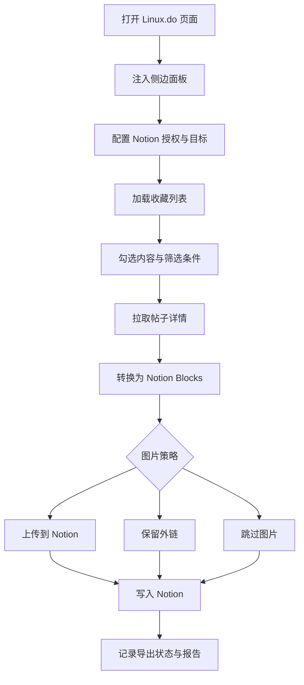

# Linux.do 导出

Linux.do 导出器用于把收藏帖子批量导入 Notion，同时尽量保留原帖结构和阅读体验。

## 支持能力

- 加载 Linux.do 收藏列表。
- 可视化勾选要导出的帖子。
- 支持只导主楼、只导楼主、楼层范围、包含 / 排除关键词等筛选。
- 图片可选择上传到 Notion、外链引用或跳过。
- 保留代码块、引用、表格、标题、列表、链接、行内格式和 Emoji。
- 支持暂停、继续、取消与进度展示。
- 支持自动导入新收藏和去重。

## 导出流程

## 自动导入

自动导入按来源独立配置。Linux.do 与 GitHub 的开关、轮询间隔和状态互不影响。

建议：

- 首次使用先手动导出少量内容。
- 确认数据库属性和格式正确后再启用自动导入。
- 页面需要保持打开；关闭标签页后不会继续轮询。
- 如果遇到 Notion 429 限速，脚本会等待后重试。

## 性能建议

| 场景 | 建议 |
| --- | --- |
| 收藏很多，列表卡顿 | 使用当前版本的分片渲染，避免频繁刷新页面 |
| 导出慢 | 并发数调到 3 或 5，请求间隔保持 200ms 以上 |
| 图片拖慢导出 | 改用外链引用或跳过图片 |
| 自动导入重复触发 | 保持最小运行间隔，不要在多个标签页同时开启 |
