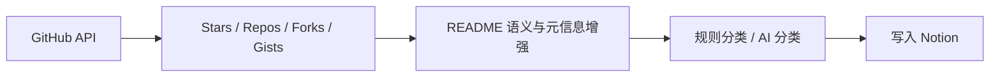
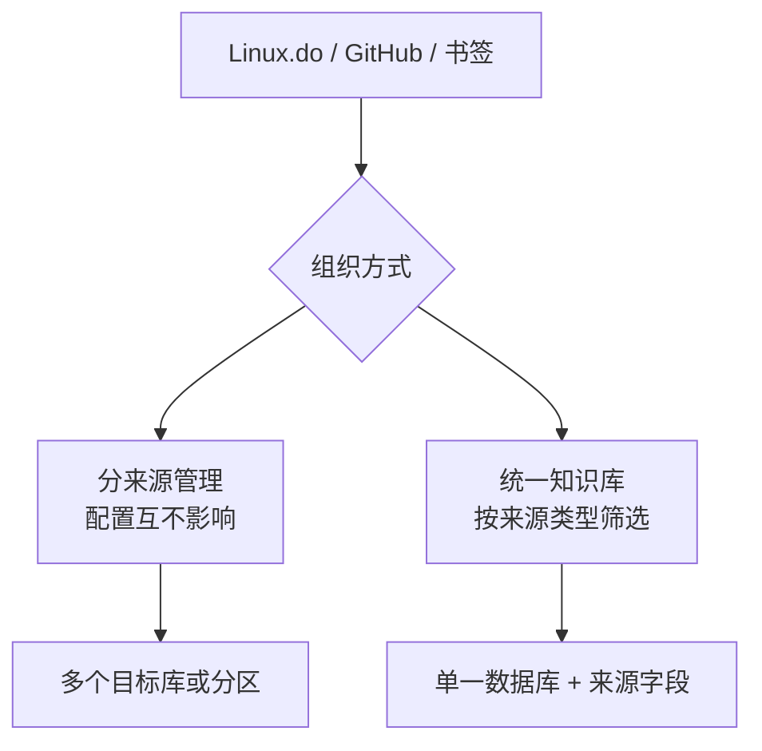

# GitHub 与浏览器书签导入

LD-Notion 可以把 Linux.do 之外的收藏来源统一导入 Notion，形成跨来源知识库。

## GitHub 导入

支持的类型：

- Stars：收藏的仓库。
- Repos：自己的仓库。
- Forks：Fork 过的仓库。
- Gists：代码片段。

导入时会保留名称、描述、语言、Stars 数、链接等信息；如果配置了 AI，也可以增强分类与标签。

## 浏览器书签导入

书签导入会读取浏览器书签树，保留文件夹路径，并尝试抽取网页标题、摘要和分类标签。

| 安装形态 | 书签读取方式 |
| --- | --- |
| 脚本版 | 通过 `chrome-extension/` 桥接扩展读取 |
| 独立扩展版 | 直接使用内置 `chrome.bookmarks` 权限 |

## 跨源整理策略

LD-Notion 支持两种理解方式：

推荐从统一数据库开始，因为后续更方便做跨源搜索、推荐相似内容、批量打标签和 AI 总结。

## 去重字段

- Linux.do：优先按帖子链接或主题 ID 去重。
- GitHub：按仓库 / Gist 唯一标识去重。
- 书签：按 URL 与路径策略去重。

如果要重新导入，可以清理对应导出记录；操作前建议先确认目标数据库中已有数据是否需要保留。
