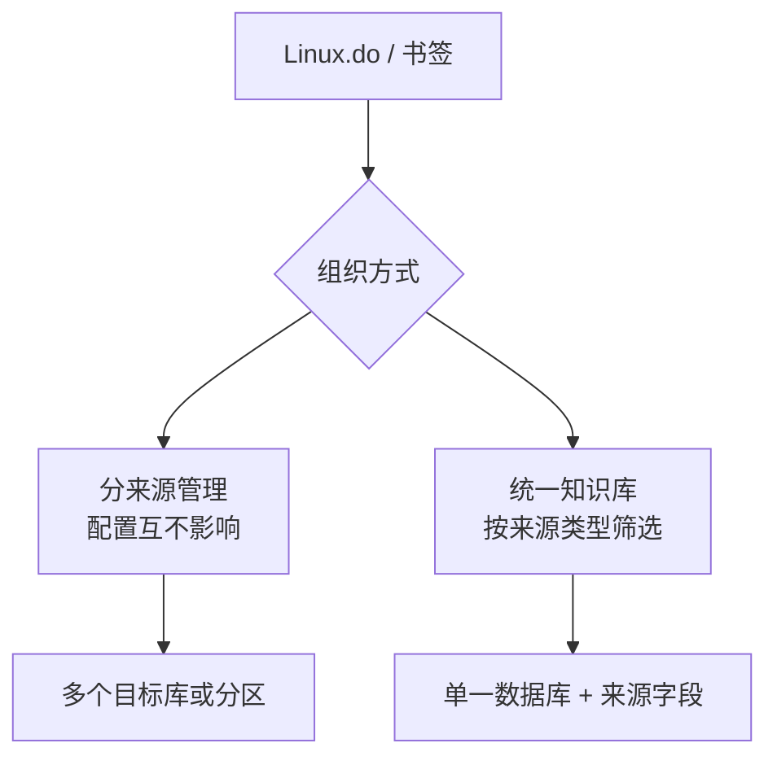

# 浏览器书签导入

LD-Notion 可以把浏览器收藏统一导入 Notion，形成跨来源知识库。

> v3.17 起 GitHub 收藏源已移除，本页仅保留浏览器书签导入说明。

## 浏览器书签导入

书签导入会读取浏览器书签树，保留文件夹路径，并尝试抽取网页标题、摘要和分类标签。

| 安装形态 | 书签读取方式 |
| --- | --- |
| 脚本版 | 通过 `chrome-extension-full/` 桥接扩展读取 |
| 独立扩展版 | 直接使用内置 `chrome.bookmarks` 权限 |

## 跨源整理策略

LD-Notion 支持两种理解方式：

```mermaid
flowchart TD
  Sources[Linux.do / 书签] --> Mode{组织方式}
  Mode --> Separate[分来源管理\n配置互不影响]
  Mode --> Unified[统一知识库\n按来源类型筛选]
  Separate --> NotionA[多个目标库或分区]
  Unified --> NotionB[单一数据库 + 来源字段]
```

推荐从统一数据库开始，因为后续更方便做跨源搜索、推荐相似内容、批量打标签和 AI 总结。

## 去重字段

- Linux.do：优先按帖子链接或主题 ID 去重。
- 书签：按 URL 与路径策略去重。

如果要重新导入，可以清理对应导出记录；操作前建议先确认目标数据库中已有数据是否需要保留。v3.13.0 起可在脚本设置面板「数据管理」区一键清除（Linux.do 去重 / 书签已导出）。
