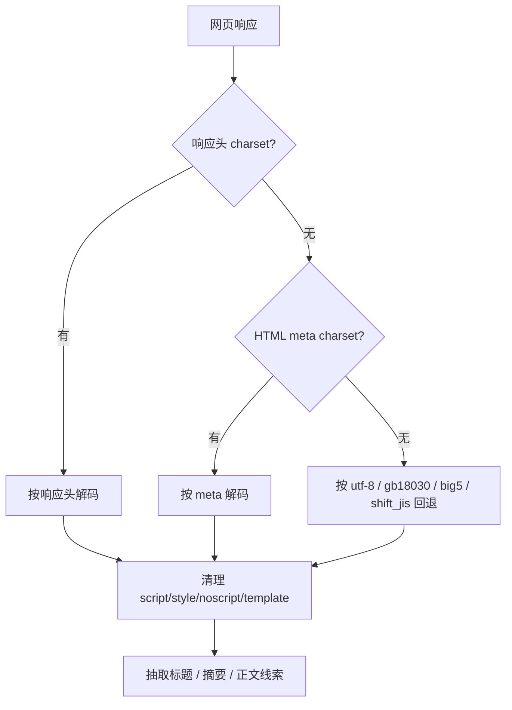

# 通用网页与 Obsidian

LD-Notion 不只运行在 Linux.do、GitHub 和 Notion，也可以在通用网页上提供剪藏入口，并支持导出到 Obsidian。

## 通用网页剪藏

通用网页入口会抽取：

- 页面标题。
- 来源 URL。
- 站点信息。
- 摘要候选。
- 主要正文线索。
- 图片与链接信息。

为了避免干扰常用搜索、邮箱、localhost 等页面，脚本头部排除了一部分站点。

## 字符集与内容清洗

网页内容可能不是 UTF-8。LD-Notion 会按以下顺序处理：

## Obsidian 导出

Obsidian 导出面向本地知识库，通常依赖 Obsidian Local REST API。

常见配置：

| 配置 | 说明 |
| --- | --- |
| Obsidian API URL | 默认类似 `https://127.0.0.1:27124` |
| API Key | Local REST API 的授权 Key |
| 输出目录 | 默认可使用 `Linux.do` |
| 图片目录 | 默认可使用 `Linux.do/attachments` |
| 图片模式 | 文件、base64 或跳过 |

## Notion 与 Obsidian 的选择

| 目标 | 适合场景 |
| --- | --- |
| Notion | 结构化数据库、协作、在线检索、AI 工作区管理 |
| Obsidian | 本地 Markdown、双链笔记、长期离线沉淀 |

两者可以并行使用：Notion 承担跨源数据库和协作层，Obsidian 承担本地归档层。
