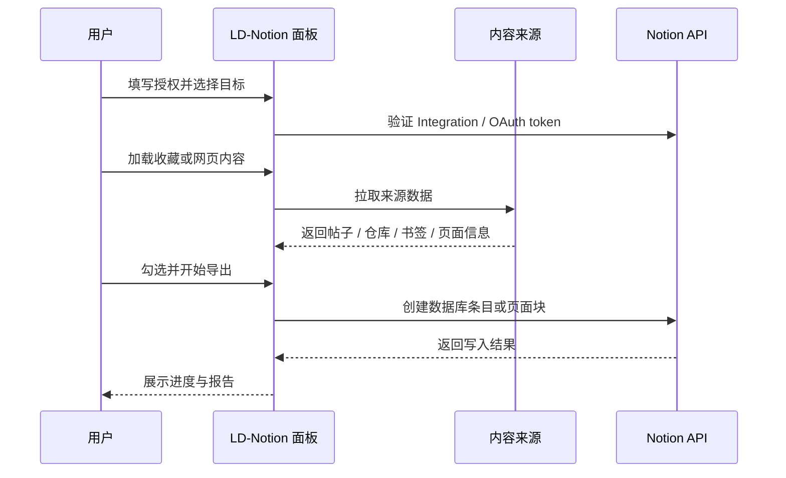

# 快速开始

LD-Notion Hub 有两种交付形态：Tampermonkey 用户脚本和独立 Chrome 扩展。两者共享核心能力，区别在于安装方式、更新方式和书签 API 的接入方式。

## 选择安装形态

| 形态 | 适合谁 | 特点 |
| --- | --- | --- |
| Tampermonkey 脚本版 | 大多数用户 | 更新方便；需要浏览器书签时额外安装桥接扩展 |
| 独立 Chrome 扩展版 | 不想依赖脚本管理器的用户 | 书签能力内置；解压安装后需要手动升级 |

## 5 分钟跑通

1. 安装脚本版或扩展版。
2. 在 Notion 创建 Integration，并授予 `Read content`、`Update content`、`Insert content`。
3. 把 Integration 连接到目标数据库或页面。
4. 打开 Linux.do、GitHub、Notion 或任意网页，确认 LD-Notion 面板出现。
5. 点击刷新工作区列表，选择数据库或页面。
6. 先导入少量内容做 smoke test，再开启批量导入或自动导入。

## 最小使用闭环

## 常用入口

- Linux.do：打开收藏页或任意已登录的 Linux.do 页面，使用侧边面板导出收藏。
- GitHub：在 GitHub 页面加载 Stars、Repos、Forks、Gists，再导入到 Notion。
- Notion：右下角浮动 AI 图标用于对话式管理工作区。
- 通用网页：右下角剪藏按钮可抽取标题、来源、摘要并导出。

## 下一步

- 安装细节见 [安装方式](/guide/install)。
- 授权和数据库设置见 [Notion 配置](/guide/notion)。
- 能力全景见 [功能地图](/features/)。
