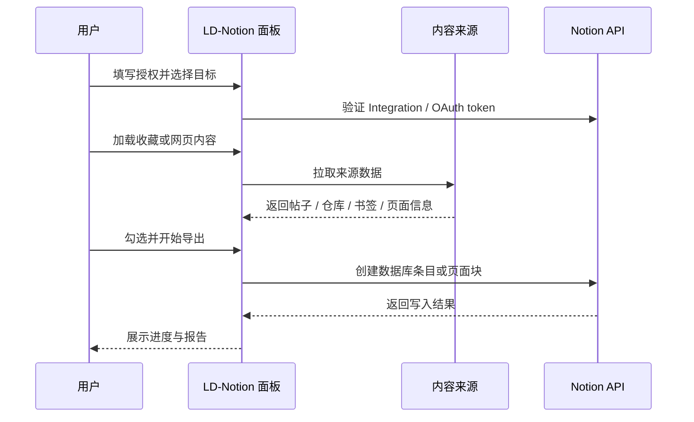

# 快速开始

LD-Notion Hub 有两种交付形态：Tampermonkey 用户脚本和独立 Chrome 扩展。两者共享核心能力，区别在于安装方式、更新方式和书签 API 的接入方式。

## 选择安装形态

| 形态 | 适合谁 | 特点 |
| --- | --- | --- |
| Tampermonkey 脚本版 | 大多数用户 | 更新方便；需要浏览器书签时额外安装桥接扩展 |
| 独立 Chrome 扩展版 | 不想依赖脚本管理器的用户 | 书签能力内置；解压安装后需要手动升级 |

## 5 分钟跑通

1. 安装脚本版或扩展版。
2. 在 Notion 创建 Integration，并授予 `Read content`、`Update content`、`Insert content`。
3. 把 Integration 连接到目标数据库或页面。
4. 打开已匹配站点（Linux.do / Notion / GitHub / 知乎），确认 LD-Notion 面板出现。油猴脚本**不再**自动注入任意网页；通用剪藏请用 Chrome 扩展，或在 Tampermonkey 中自行添加 `@match`。
5. 点击刷新工作区列表，选择数据库或页面。
6. 先导入少量内容做 smoke test，再开启批量导入或自动导入。

> 自 v3.14.28 起，① GitHub 连接支持 **OAuth 授权（免手动创建 PAT）**：面板填入 OAuth Client ID（github.com/settings/developers 创建 OAuth App，公开信息）后点「通过 GitHub 授权」，浏览器输入一次性代码即可，Token 自动填入；手动粘贴 PAT 保留兑底。② 书签 Tab 新增「🧹 整理书签」（需 Chrome 扩展模式）：重复去重 + 失效链接检测 + AI 归类散落书签，全程**零删除**（仅移动到「LD-Notion 整理/」文件夹）+ 自动备份 + 预览确认 + 可撤销。

> 自 v3.14.25 起，三个「立即导入」按钮（Linux.do / GitHub / 书签）在配置缺失或认证失败时会**就地红显真实原因与行动指引**（如 GitHub 用户名不存在/已改名、Token 失效），不再绿显「完成 0 条」静默吞错；GitHub 未填 Token 时仅依赖用户名探测，推荐填入 Token（PAT）走认证接口。
>
> 自 v3.15.0 起，RSS 源已移除（导入器/适配器/配置键删除，存量同步状态自动剪枝；历史 RSS 导出账本保留，防重复导出）。

## 最小使用闭环

```mermaid
sequenceDiagram
  participant User as 用户
  participant Panel as LD-Notion 面板
  participant Source as 内容来源
  participant Notion as Notion API

  User->>Panel: 填写授权并选择目标
  Panel->>Notion: 验证 Integration / OAuth token
  User->>Panel: 加载收藏或网页内容
  Panel->>Source: 拉取来源数据
  Source-->>Panel: 返回帖子 / 仓库 / 书签 / 页面信息
  User->>Panel: 勾选并开始导出
  Panel->>Notion: 创建数据库条目或页面块
  Notion-->>Panel: 返回写入结果
  Panel-->>User: 展示进度与报告
```

## 常用入口

- Linux.do：打开收藏页或任意已登录的 Linux.do 页面，使用侧边面板导出收藏。
- GitHub：在 GitHub 页面加载 Stars、Repos、Forks、Gists，再导入到 Notion。
- Notion：右下角浮动 AI 图标用于对话式管理工作区。
- 通用网页：Chrome 扩展版在任意网页右下角提供剪藏；油猴脚本仅在显式 `@match` 站点注入（见下方列表）。

## 油猴脚本 `@match`（v3.14.8）

脚本仅在以下模式注入（审计移除任意网页 catch-all 后）：

- `https://linux.do/*`、`https://*.linux.do/*`
- `https://www.notion.so/*`、`https://notion.so/*`、`https://*.notion.so/*`
- `https://github.com/*`、`https://www.github.com/*`、`https://gist.github.com/*`
- `https://www.zhihu.com/*`、`https://zhuanlan.zhihu.com/*`

Chrome 扩展仍包含 `http://*/*` / `https://*/*` 通用匹配（另有搜索引擎等 exclude）。需要在未列出站点使用油猴剪藏时，请在 Tampermonkey 中为该站点添加用户 `@match`。

## 下一步

- 安装细节见 [安装方式](/guide/install)。
- 授权和数据库设置见 [Notion 配置](/guide/notion)。
- 能力全景见 [功能地图](/features/)。
