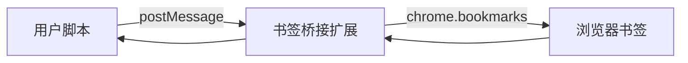

# 安装方式

## 方式 A：Tampermonkey 脚本版

这是推荐安装方式，适合需要跟随脚本更新通道升级的用户。

### 安装步骤

1. 在 Chrome 或 Edge 安装 Tampermonkey。
2. 安装 `LinuxDo-Bookmarks-to-Notion.user.js`。
3. 打开以下页面之一验证入口：
   - `https://linux.do/u/你的用户名/activity/bookmarks`
   - `https://www.notion.so/`
   - `https://github.com/`
4. 如需读取浏览器书签，继续安装 `chrome-extension/` 桥接扩展。

### 书签桥接扩展

脚本本身不能直接调用 `chrome.bookmarks`，所以脚本版读取书签时需要一个极简扩展：



本地安装步骤：

1. 打开 `chrome://extensions/`。
2. 开启「开发者模式」。
3. 选择「加载已解压的扩展程序」。
4. 选择项目中的 `chrome-extension/` 目录。

## 方式 B：独立 Chrome 扩展版

独立扩展版不依赖 Tampermonkey，书签读取、GM API shim、CORS 代理和 Popup 都由扩展提供。

### 本地构建

```bash
npm run build:extension
```

构建输出目录：`chrome-extension-full/`。

### 本地加载

1. 打开 `chrome://extensions/`。
2. 开启「开发者模式」。
3. 点击「加载已解压的扩展程序」。
4. 选择 `chrome-extension-full/`。

## 两种形态对比

| 能力 | 脚本版 | 独立扩展版 |
| --- | --- | --- |
| Linux.do 导出 | 支持 | 支持 |
| Notion 站点 AI 面板 | 支持 | 支持 |
| GitHub 导入 | 支持 | 支持 |
| 浏览器书签导入 | 需要桥接扩展 | 内置 |
| 更新方式 | Tampermonkey 更新通道 | ZIP / 解压目录手动更新 |
| 扩展 Popup | 无 | 有 |

## 安装后检查

- Linux.do 页面出现侧边工具面板。
- Notion 页面右下角出现 AI 浮动按钮。
- GitHub 页面可进入来源分区并加载内容。
- 通用网页右下角出现剪藏按钮。
- 书签导入入口能识别桥接扩展或独立扩展能力。
