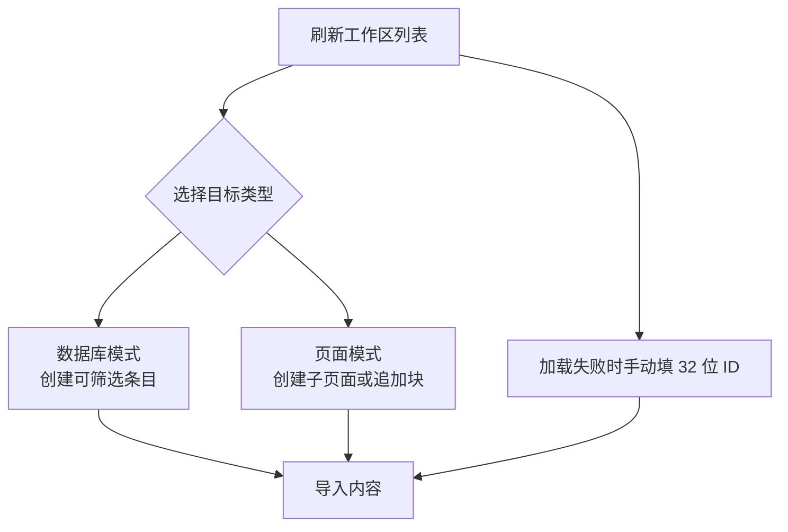

# Notion 配置

LD-Notion 需要 Notion 授权后才能读取工作区、创建数据库条目、写入页面块和管理页面元数据。

## 授权方式

| 方式 | 适合场景 | 说明 |
| --- | --- | --- |
| Internal Integration Token | 个人使用、最稳定 | 手动复制 `secret_` token 到面板 |
| Public OAuth | 希望一键授权 | 需要配置 Client ID、Client Secret 与 Redirect URI |

## 创建 Integration

1. 打开 Notion Integrations。
2. 创建新 Integration，选择目标 Workspace。
3. 在 Capabilities 中勾选：
   - `Read content`
   - `Update content`
   - `Insert content`
4. 复制 Internal Integration Token。

## 公开 OAuth 可选配置

如果你使用公开集成授权：

1. 将 Notion 集成改为 Public。
2. 添加 Redirect URI，推荐使用 `https://www.notion.so/`。
3. 复制 `Client ID` 和 `Client Secret`。
4. 先在 LD-Notion 面板里初始化并解锁本地凭证保险箱。
5. 在 LD-Notion 面板填写 OAuth 配置。
6. 点击 `一键授权`，授权完成后自动把 access token / refresh token 写入本地加密保险箱。

::: warning 注意
LD-Notion 是纯前端运行。`Client Secret`、access token、refresh token 和手动 `secret_` Token 会保存在你的本地加密保险箱中，只有在当前会话解锁后才可直接使用。该模式更适合个人自建公开集成，不适合把共享生产级 secret 放到前端。
:::

## 数据库属性

推荐数据库包含这些属性：

| 属性名 | 类型 | 用途 |
| --- | --- | --- |
| 标题 | Title | 内容标题 |
| 链接 | URL | 原始链接 |
| 分类 | Text | AI 或规则分类 |
| 标签 | Multi-select | 多标签整理 |
| 作者 | Text | 内容作者 |
| 收藏时间 | Date | 收藏或导入时间 |
| 帖子数 | Number | Linux.do 回复数量 |
| 浏览数 | Number | 浏览量 |
| 点赞数 | Number | 点赞数 |
| 来源类型 | Select / Text | Star、Repo、Gist、书签等来源 |
| 书签路径 | Text | 浏览器书签文件夹路径 |

实际使用中可以先连接数据库，再用面板中的自动设置能力补齐缺失属性。

## 连接 Integration

1. 打开目标数据库或页面。
2. 点击右上角 `...`。
3. 进入 `Connections`。
4. 选择刚创建的 Integration。

这是最容易遗漏的一步。如果未连接 Integration，LD-Notion 即使拿到 token 也无法访问目标数据库或页面。

## 选择导出目标

- 数据库模式：适合结构化收藏、排序、筛选、分类和标签。
- 页面模式：适合树状笔记或把内容沉淀到指定父页面下。

## 验证配置失败时

优先检查：

1. Token 是否完整，Internal Integration Token 应以 `secret_` 开头。
2. 是否已经把 Integration 连接到数据库或页面。
3. 是否先刷新工作区列表并选择目标。
4. 手动输入 ID 时是否只输入 32 位 ID，而不是整段 URL。
5. OAuth 模式下 Redirect URI 是否与 Notion 集成配置一致。
