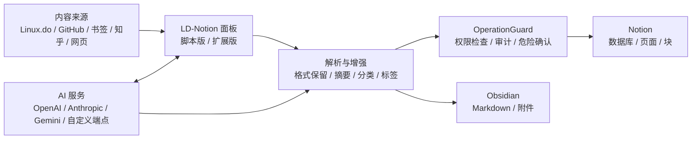

## 一张图理解 LD-Notion

## 推荐阅读路径

1. 先看 [快速开始](/guide/getting-started)，确认你要使用脚本版还是独立扩展版。
2. 按 [Notion 配置](/guide/notion) 创建 Integration、授权并选择数据库或页面。
3. 从 [功能地图](/features/) 选择你的入口：Linux.do 导出、GitHub 导入、浏览器书签、AI 助手或网页剪藏。
4. 如果要二次开发，阅读 [整体架构](/architecture/overview) 与 [开发与验证](/development)。

## 深入理解系统

- [Concepts](/concepts/)：从机制地图理解 LD-Notion 的核心边界。
- [Routing Rules](/concepts/routing-rules)：理解来源、目标、授权、AI 和权限如何共同决定处理路径。
- [Import Pipeline](/concepts/import-pipeline)：理解内容从捕获到写入、审计和失败处理的状态流。
- [OperationGuard](/concepts/operation-guard)：理解写入动作前的权限、确认和审计网关。
- [Extension Architecture](/concepts/extension-architecture)：理解用户脚本、扩展构建和部署边界。
