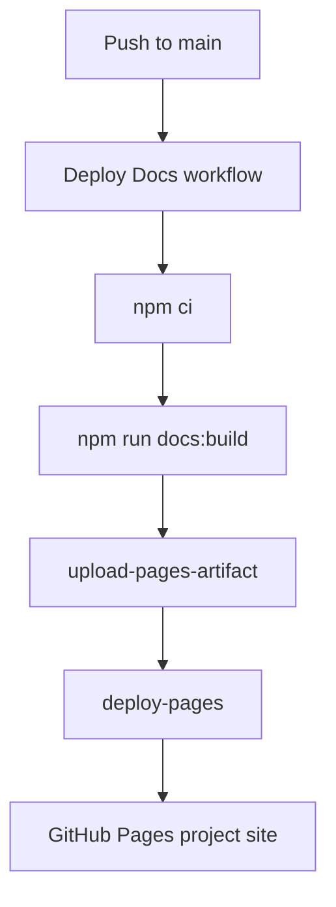

# Deployment

本项目文档站使用 VitePress 构建，并通过 GitHub Pages 项目站点部署。

## GitHub Pages 项目站点

当前站点是项目站点，而不是用户 / 组织站点：

| Type | URL format | Limit |
| --- | --- | --- |
| 用户 / 组织站点 | `https://用户名.github.io/` | 每个账号或组织通常 1 个 |
| 项目站点 | `https://用户名.github.io/仓库名/` | 每个仓库可以 1 个 |

LD-Notion 的文档站地址：

```text
https://smith-106.github.io/LD-Notion/
```

## VitePress base

因为这是项目站点，资源路径需要带仓库名前缀：

```ts
export default defineConfig({
  base: '/LD-Notion/'
})
```

如果 `base` 配错，常见现象是首页能打开但 CSS、JS 或内部链接 404。

## Deploy Docs workflow

部署流程：



## Verification workflows

- `.github/workflows/verify.yml`
  - 触发：`pull_request`、推送到 `main`
  - 作用：执行 `npm ci`、`npm run verify:delivery`、`npm run docs:build`
- `.github/workflows/build-extension-release.yml`
  - 触发：`release.published`、手动 `workflow_dispatch`
  - 作用：先跑完整 `verify:delivery` 交付闸门，再打包 `chrome-extension-full` ZIP 并上传到 Release

## Local commands

```bash
npm --prefix LD-Notion run docs:dev
```

```bash
npm --prefix LD-Notion run docs:build
```

```bash
npm --prefix LD-Notion run docs:preview
```

```bash
npm --prefix LD-Notion run verify:delivery
```

## Generated output

VitePress 构建产物位于：

```text
LD-Notion/docs/.vitepress/dist
```

该目录是构建产物，不应提交到仓库。

## Contract

- GitHub Pages MUST use workflow deployment mode。
- VitePress `base` MUST remain `/LD-Notion/` for project site deployment。
- `docs/.vitepress/dist/` MUST stay ignored。
- Pull requests and pushes to `main` SHOULD pass `verify:delivery` before they are considered releasable。
- Deployment changes SHOULD be verified by checking the live homepage after Actions completes。
