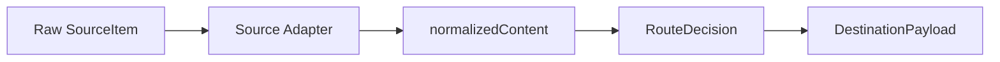

# Normalized Content Schema

Normalized Content Schema 是导入链路中的文档契约，用于说明来源数据如何转换为统一内容，再转换为 Notion 或 Obsidian 目标 payload。它不要求代码中立即存在同名类型。

## Why it exists

Linux.do 帖子、GitHub 仓库、浏览器书签、知乎文章和通用网页的原始字段不同，但写入目标需要稳定结构。Normalized Content 让后续路由、AI 增强、权限检查和目标写入不必关心来源差异。



## Field Groups

| Group | Fields | Purpose |
| --- | --- | --- |
| identity | `source`, `sourceId`, `url` | 追踪来源、去重和审计 |
| content | `title`, `body`, `excerpt` | 承载用户可读内容 |
| metadata | `author`, `createdAt`, `tags`, `category` | 保留来源上下文和分类信息 |
| routing | `destination`, `collection`, `template` | 指定目标和写入形态 |
| audit | `capturedAt`, `guardDecision`, `importStatus` | 记录导入状态和安全决策 |

## SourceItem example

```json
{
  "source": "github",
  "sourceId": "Smith-106/LD-Notion",
  "url": "https://github.com/Smith-106/LD-Notion",
  "rawMetadata": {
    "name": "LD-Notion",
    "description": "AI 多源知识中枢",
    "language": "JavaScript",
    "stars": 123
  }
}
```

## normalizedContent example

```json
{
  "identity": {
    "source": "github",
    "sourceId": "Smith-106/LD-Notion",
    "url": "https://github.com/Smith-106/LD-Notion"
  },
  "content": {
    "title": "LD-Notion — AI 多源知识中枢",
    "body": "统一连接 Linux.do、GitHub、浏览器书签与 Notion。",
    "excerpt": "浏览器侧知识采集与 Notion/Obsidian 输出工具。"
  },
  "metadata": {
    "author": "Smith-106",
    "createdAt": null,
    "tags": ["notion", "userscript", "extension"],
    "category": "工具"
  },
  "routing": {
    "destination": "notion-database",
    "collection": "knowledge-hub",
    "template": "github-repository"
  },
  "audit": {
    "capturedAt": "2026-05-13T00:00:00+08:00",
    "guardDecision": "pending",
    "importStatus": "normalized"
  }
}
```

## DestinationPayload example

```json
{
  "target": "notion-database",
  "databaseId": "<redacted>",
  "properties": {
    "标题": "LD-Notion — AI 多源知识中枢",
    "链接": "https://github.com/Smith-106/LD-Notion",
    "分类": "工具",
    "标签": ["notion", "userscript", "extension"],
    "来源类型": "Repo"
  },
  "children": [
    {
      "type": "paragraph",
      "text": "统一连接 Linux.do、GitHub、浏览器书签与 Notion。"
    }
  ]
}
```

## Mapping by source

| Source | Identity | Content | Metadata | Notes |
| --- | --- | --- | --- | --- |
| Linux.do | topic id / URL | 主楼、楼层、引用、代码块 | 作者、收藏时间、回复数、浏览数 | 需要格式转换为 Notion Blocks |
| GitHub | repo full name / gist id | 描述、README 摘要 | language、stars、forks、topics | 可用 README 语义增强分类 |
| Bookmarks | URL + folder path | 页面标题、摘要 | 书签路径、域名、标签 | 脚本版依赖桥接扩展 |
| Zhihu | article / answer URL | 标题、正文摘要 | 作者、来源类型 | 可能降级为通用网页剪藏 |
| Generic web | URL | title、excerpt、正文线索 | site、charset、meta tags | 需要字符集与噪声清理 |

## Contract

- `source` and `url` SHOULD exist for every normalized item。
- DestinationPayload MUST redact secrets and internal tokens。
- Missing optional metadata SHOULD NOT block import。
- Missing identity fields SHOULD block dedup-sensitive writes。
